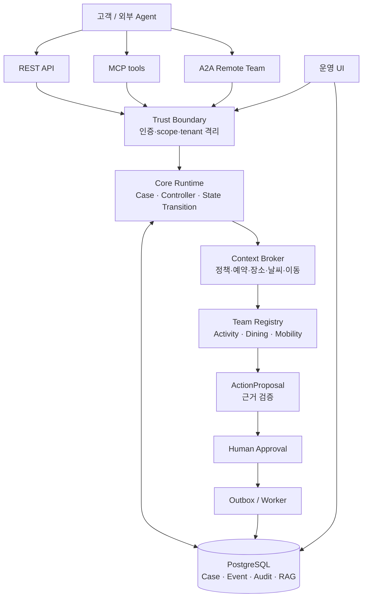

# triPilot

> 팀 A-COPilot이 개발하는 AI 연동형 모듈형 Agentic Customer Operations Platform

triPilot은 고객의 자연어 요청을 업무 **Case**로 접수하고, 현재 상태·정책·이력·외부 데이터로 Context를 구성한 뒤, 도메인별 Agent Team이 근거 기반의 확인 결과와 후속 조치 제안을 반환하는 고객운영 플랫폼입니다. 개발 팀은 **A-COPilot**입니다.

현재 제품 도메인은 **여행 CS**입니다. 여행 계획을 직접 생성하는 서비스가 아니라, 외부 에이전트나 고객이 제출한 여행 일정·예약을 검증하고 변경 가능성, 운영시간, 이동 가능성, 날씨·장소 정보를 확인해 여행 중 변경을 관리하는 시스템을 지향합니다.

## 팀 소개

`triPilot`은 `A-COPilot` 6인 팀이 개발합니다. 아래 역할은 발표 자료의 공식 Ownership 기준이며, 6인 전원이 데이터 전처리에 공통 참여합니다.

| 팀원 | 담당 영역 | 주요 역할 |
|---|---|---|
| 최연우 | Core 1 Runtime | Case 12단계 상태전이 머신, CAS 동시성 제어, 2축 Registry 라우팅 |
| 서유현 | Mobility Team | 실시간 운행 중단·도로 통제 감지, 우회로 탐색, 출발 시각 역산 알고리즘 |
| 정세환 | Dining Team | 영업시간·브레이크타임 대조, 해외카드 결제 검증, CatchTable·Tripadvisor 연동 |
| 최상욱 | UI & 검증 (요식 지원) | 동적 여행계획서 웹(`/t/{token}`), 18개 MVP DoD 검증 하네스, 요식업 데이터 정제 |
| 김지혜 | Activity Team | 관람·체험·쇼핑 성립 검증, 기상청 초단기예보 감시, 다국어 프롬프트 템플릿 |
| 송채영 | Activity Team | 관람·체험·쇼핑 성립 검증, 기상청 초단기예보 감시, 다국어 프롬프트 템플릿 |

> 공통 역할: 6인 전원 데이터 전처리 참여, 파이프라인 총괄 및 DB 무결성 관리

## 프로젝트 현황과 범위

| 항목 | 현재 기준 |
|---|---|
| 도메인 | 여행 고객운영(Travel CS) |
| 기준 상품 | 서울 1개 도시 · 최대 7일 · 최대 4인 |
| MVP Team | Activity · Dining · Mobility |
| MVP 이후 | Booking Handoff |
| 등록만 된 Team | Lodging · Flight — 잠긴 예약으로 취급하며 자체 로직은 제공하지 않음 |
| 핵심 원칙 | 근거 없는 확답 금지, Team의 직접 실행 금지, 승인 없는 side effect 금지 |
| 문서 기준선 | `program/plan/A-COP_구현계획서_v11.md` |

> MVP 범위 밖 기능을 현재 제공 기능처럼 설명하지 않습니다. 특히 Booking Handoff와 업체 예약 변경은 승인·연동 범위를 별도로 검증해야 합니다.

## 해결하려는 문제

여행 중에는 일정 항목, 예약, 운영시간, 이동시간, 날씨와 같은 정보가 서로 영향을 줍니다. 단순 챗봇은 오래된 정보나 근거 없는 추정을 섞기 쉽고, 자동화 시스템은 예약 변경처럼 되돌리기 어려운 작업을 잘못 실행할 위험이 있습니다.

triPilot은 다음 순서로 이 문제를 분리합니다.

1. 고객 메시지를 Case로 만들고 감성·요청 종류·대상 객체를 분류합니다.
2. `case_type`과 `intent`를 분리해 담당 Team을 선택합니다.
3. 정책·예약·장소·날씨·이동 정보를 읽기 경로로 수집합니다.
4. Team은 `TeamResult`와 `ActionProposal`만 반환합니다.
5. 근거가 있는 제안만 운영자가 승인할 수 있습니다.
6. 승인·배달·실행 결과는 이벤트와 감사 기록으로 남깁니다.

## 주요 기능

- **Case lifecycle**: 생성, 분류, 라우팅, Team 실행, 승인 대기, 재개, 완료/에스컬레이션을 이벤트 기반으로 관리
- **여행 Team**: 활동(Activity), 식음(Dining), 이동(Mobility)의 가능 여부와 예외 상황 판정
- **근거 기반 응답**: 정책·예약·장소·기상 등 Evidence를 답변과 제안에 연결
- **RAG 검색**: 정책 문서를 청크로 나누고 OpenAI 임베딩과 PostgreSQL/pgvector로 검색
- **외부 데이터 어댑터**: Open-Meteo, 국가유산청, 관광정보·공휴일·교통·공항 등 외부 소스를 설정에 따라 연결
- **승인 경계**: Team은 환불·예약 변경·알림 같은 side effect를 실행하지 않고 제안만 생성
- **멱등성과 outbox**: 중복 요청·중복 메시지 발행을 DB 제약과 영속 outbox로 방어
- **운영 UI**: Case, Trace, Approval, VOC, Outbox unknown 상태를 확인
- **REST/MCP/A2A 접점**: 외부 에이전트·운영자·원격 Team이 동일한 Core 계약을 사용
- **Composer 관리 채널**: 프로젝트 설정 검증·변경은 관리용 빌드에서만 별도 인증 경로로 제공

## 아키텍처



### 계층별 책임

| 계층 | 책임 | 대표 위치 |
|---|---|---|
| Presentation | REST, MCP, A2A, 운영 UI, 인증 경계 | `final_project_cs/app/presentation/` |
| Application | Case 접수·분류·라우팅·Controller·배치 | `final_project_cs/app/application/` |
| Core/Domain | 계약, 상태 전이, Registry, 멱등성, 안전 규칙 | `final_project_cs/app/core/`, `app/domain/` |
| Teams | 여행 도메인 판정과 제안 | `final_project_cs/app/modules/travel_ops/` |
| Infrastructure | PostgreSQL, pgvector, 외부 API, LLM, outbox | `final_project_cs/app/infrastructure/` |
| Knowledge | 정책 원문, manifest, ingest | `final_project_cs/knowledge/` |

### 라우팅과 분류

분류 결과에는 두 축이 있습니다.

- `intent`: 일정 제출, 사건 신고, 확인 요청, 조정 거부, 그 외
- `issue_code`: 대상 객체와 상황을 나타내며 접두사가 `case_type`이 됩니다. 예를 들어 `activity_...`, `dining_...`, `mobility_...`와 같이 Team 대상이 결정됩니다.

요청 종류만으로 Team을 고르지 않습니다. 분류 실패나 대상이 불명확한 경우 임의의 Team으로 보내지 않고 에스컬레이션합니다.

## Team 책임

| Team | 책임 | 대표 capability |
|---|---|---|
| Activity | 활동의 취소 가능 여부, 시간·정원·날씨 조건, 변경 제안 | `activity.check_cancelable`, `activity.check_feasible`, `activity.propose_change` |
| Dining | 식당 운영시간·휴무·동행 조건 확인, 대안 제안 | `dining.check_hours`, `dining.check_conditions` |
| Mobility | 구간 이동시간·대중교통·막차·예외 확인 | `mobility.check_route`, `mobility.status`, `mobility.exception` |
| Booking Handoff | 공급자 예약 원장 대조와 승인 대기 전환 | MVP 다음 단계 |
| Lodging / Flight | 예약 영역 등록과 경계만 제공 | 등록 전용, 자체 변경 로직 없음 |

Team은 허용된 read tool만 사용하고, 외부 시스템에 직접 쓰지 않습니다. 예약 변경·취소·업체 통지 등 실행이 필요한 경우 `ActionProposal → 검증 → Human Approval → 실행/배달` 경로를 거칩니다.

## 저장소 구성

| 경로 | 역할 |
|---|---|
| [`final_project_cs/`](final_project_cs/) | 릴리스 대상 제품 코드, 여행 Team, API, DB, 평가·테스트 |
| [`final_project_sample/`](final_project_sample/) | Core/Team 계약과 Composer 인프라를 먼저 검증하는 참고 구현체 |
| [`final_project_ui/`](final_project_ui/) | 대상 프로젝트를 읽어 보여주는 읽기 중심 개발 콘솔 |
| [`program/`](program/) | 기획서·조사·발표·제출 산출물 |
| [`datasets/`](datasets/) | 데이터셋과 전처리 결과. 각 폴더의 `README.md`와 `REPORT.md`가 기준 |
| [`wiki/`](wiki/) | 중앙 허브와 프로젝트 지식 지도 |

`final_project_cs` 내부의 상세 설계는 [`final_project_cs/wiki/index.md`](final_project_cs/wiki/index.md)에서 영역별로 연결됩니다.

## 기술 스택

| 영역 | 기술 |
|---|---|
| 실행 환경 | Python 3.12.7, PostgreSQL 16.14 |
| API/웹 서버 | FastAPI 0.116.1, Uvicorn 0.35.0, Pydantic 2.13.4, pydantic-settings |
| 데이터베이스 | PostgreSQL, `psycopg` 3.3.4, pgvector 0.5.0, pgcrypto |
| 데이터 접근/마이그레이션 | `psycopg` 직접 SQL, 반복 실행 가능한 SQL migration runner |
| LLM | OpenAI SDK 2.44.0, `openai`·`local_ft`·`mock` adapter, 모델·temperature·seed 설정 |
| 오케스트레이션 | 자체 Core Controller·Registry·Port 구조 |
| RAG/토큰 | OpenAI Embeddings, `tiktoken` 0.13.0, PostgreSQL/pgvector vector search |
| 연동 프로토콜 | REST API, MCP 1.28.1(FastMCP read-only 3개 도구), A2A HTTP |
| 외부 연동 | `httpx` 0.28.1 기반 여행 데이터 어댑터, 소스별 rate limit |
| Graph | PostgreSQL Recursive CTE 기반 `SqlGraphAdapter`(별도 Graph DB 없음) |
| 운영 화면 | FastAPI server-rendered HTML/CSS/vanilla JavaScript, 별도 `final_project_ui` 개발 콘솔 |
| 평가 | NumPy 2.2.1, SciPy 1.15.1, scikit-learn 1.6.1 |
| 품질 | pytest 7.4.4, pytest-asyncio 0.25.2, 계약·단위·통합·아키텍처·e2e 테스트 |
| 설정/폼 | PyYAML, python-dotenv, python-multipart |

> `requirements.txt`에 선언된 SQLAlchemy·Alembic·LangGraph·LangChain Core는 현재 제품 소스에서 import·사용되지 않으므로 구현 완료 스택으로 표기하지 않습니다. 실제 도입 시 사용 범위와 문서를 함께 갱신합니다.

## 로컬 실행

아래 명령은 Windows PowerShell 기준입니다. DB는 Docker를 전제로 하지 않으며, PostgreSQL 16+와 `pgvector` 확장이 필요합니다.

### 1. Python 환경과 의존성

```powershell
cd final_project_cs
py -3.12 -m venv .venv
.\.venv\Scripts\Activate.ps1
python -m pip install -r requirements.txt
```

### 2. 환경변수

```powershell
Copy-Item .env.example .env
Copy-Item .env.apikeys.example .env.apikeys
```

`.env`에는 DB·LLM·앱 설정을, `.env.apikeys`에는 여행 외부 데이터 소스 키를 입력합니다. 두 파일 모두 커밋하지 않습니다.

최소한 다음 값은 실제 환경에 맞게 채워야 합니다.

```dotenv
ACOP_DATABASE_URL=postgresql+psycopg://postgres@127.0.0.1:5433/acop_cs
ACOP_LLM_PROVIDER=openai
ACOP_OPENAI_API_KEY=발급받은_키
ACOP_LLM_MODEL=gpt-4o-mini
ACOP_EMBEDDING_MODEL=text-embedding-3-small
ACOP_TENANT_ID=demo
ACOP_SECRET_KEY=충분히_긴_랜덤_시크릿
ACOP_COMPOSER_JWT_SECRET=관리용_시크릿
ACOP_COMPOSER_ISSUER_SECRET=관리용_별도_시크릿
```

설정은 선언되지 않은 환경변수를 허용하지 않으며, 필수값이 없으면 조용한 데모 모드로 전환하지 않고 실패합니다. 운영 환경에서는 예시 시크릿을 반드시 교체합니다.

### 3. DB 스키마와 지식 데이터

먼저 `ACOP_DATABASE_URL`이 가리키는 PostgreSQL 데이터베이스를 준비한 뒤 마이그레이션을 실행합니다.

```powershell
python -m app.infrastructure.db.migrate
python -m scripts.check_env
```

정책 코퍼스 구조만 확인하려면:

```powershell
python -m knowledge.ingest --dry-run
```

OpenAI 임베딩까지 적재하려면:

```powershell
python -m knowledge.ingest
```

임베딩 모델을 바꾸면 `config/guardrails.yaml`의 차원과 DB의 `vector(1536)` 스키마, 기존 적재 데이터를 함께 검토해야 합니다.

### 4. API 서버

고객/외부 Agent용 릴리스 빌드는 Composer 쓰기 라우터를 포함하지 않습니다.

```powershell
python -m uvicorn app.presentation.api.app:app --host 127.0.0.1 --port 8041 --reload
```

확인:

```powershell
Invoke-RestMethod http://127.0.0.1:8041/health
```

관리용 Composer 빌드가 필요한 경우에만 `app.entrypoint:app`을 사용하며, `acop_composer` 패키지와 별도 인증 시크릿이 필요합니다.

## API 표면

모든 운영 API는 `Authorization: Bearer <api_key>`와 endpoint별 scope를 사용합니다. 다른 고객 또는 tenant의 리소스는 존재 여부를 노출하지 않도록 404로 처리합니다.

| 메서드 | 경로 | 필요 scope | 설명 |
|---|---|---|---|
| `POST` | `/v1/cases` | `case:write` | Case 생성과 분류 시작 |
| `GET` | `/v1/cases` | `case:read` | Case 목록 조회 |
| `GET` | `/v1/cases/{case_id}` | `case:read` | Case 상세 조회 |
| `POST` | `/v1/cases/{case_id}/messages` | `case:write` | Case에 추가 메시지 등록 |
| `POST` | `/v1/cases/{case_id}/actions/{action_id}/approve` | `action:approve` | 제안 승인/거절 |
| `POST` | `/v1/outbox/{message_id}/resolve` | `action:approve` | unknown 배달 결과를 사람이 확인해 기록 |
| `GET` | `/introspection` | `ops:introspect` | 현재 조립·모듈 상태 조회 |
| `POST` | `/admin/reload` | `ops:reload` | 검증된 설정을 재기동 없이 반영 |
| `GET` | `/health` | 없음 | 프로세스 상태 확인 |

MCP 도구는 `mcp:read` 범위로 제공합니다.

- `get_my_cases`: 고객 Case 목록
- `get_case_detail`: 고객 Case 상세
- `open_support_case`: Case 생성과 분류 시작. 승인·결제·예약 변경은 수행하지 않음

운영 UI는 다음 경로를 사용합니다.

`/ui/admin` · `/ui/cases` · `/ui/cases/{case_id}` · `/ui/cases/{case_id}/trace` · `/ui/approvals` · `/ui/voc` · `/ui/ops/outbox`

## 데이터·외부 소스

### 내부 데이터

핵심 업무 상태는 PostgreSQL이 권위 있는 원천입니다.

- `customer_cases`: Case 현재 상태 projection
- `case_events`: append-only 상태 변경 이벤트
- `agent_runs`, `team_tasks`: Agent 실행 추적
- `action_requests`, `action_approvals`: 제안·승인·멱등성
- `outbox`: 영속 메시지와 배달 상태
- `knowledge_documents`, `knowledge_chunks`: 정책 문서와 임베딩
- `feedback_analytics_reports`: VOC 일일 집계
- 여행 도메인: `places`, `bookings`, `supplier_bookings`, `place_catalog`, `watch_observations` 등

### 외부 소스

Open-Meteo와 국가유산청 소스는 키 없이 연결되는 경로가 있으며, 관광정보·공휴일·기상청·교통·대기질·공항·지도·길찾기 소스는 `.env.apikeys` 설정에 따라 활성화됩니다. 소스별 일일 호출량과 최소 호출 간격을 적용하고, 실패한 소스를 성공한 것처럼 대체하지 않습니다.

## 안전·운영 불변식

실무 운영에서 가장 중요한 규칙은 기능 목록보다 아래 경계입니다.

- Core는 특정 Team 내부 구현을 import하지 않고 Registry 계약만 사용합니다.
- Team은 외부 쓰기나 side effect를 수행하지 않고 `ActionProposal`만 반환합니다.
- Case 상태는 `transition_case()` 단일 진입점으로 변경합니다.
- 이벤트와 감사 기록은 append-only입니다.
- 동일 요청은 idempotency key로 한 번만 처리합니다.
- 모든 조회는 tenant/customer 범위로 제한합니다.
- PII는 저장·응답·감사·LLM 전달 경로에서 마스킹 규칙을 적용합니다.
- Evidence가 없으면 확정 문장을 만들지 않고 `unknown` 또는 `escalated`로 남깁니다.
- 외부 provider timeout을 성공으로 추정하지 않습니다.
- Outbox의 `unknown` 메시지는 자동 재실행하지 않고 사람이 확인한 근거를 기록합니다.

상세 규칙은 [`final_project_cs/CLAUDE.md`](final_project_cs/CLAUDE.md), [`final_project_cs/RULE.md`](final_project_cs/RULE.md), [`final_project_cs/wiki/quality/invariants.md`](final_project_cs/wiki/quality/invariants.md)를 확인합니다.

## 운영 명령

```powershell
# 전체 환경 점검
python -m scripts.check_env

# 한 번의 outbox 배달 작업
python -m scripts.run_outbox_worker --once

# 멈춘 classifying/routing Case 회수
python -m scripts.run_sweepers --once

# VOC 일일 리포트 생성
python -m scripts.run_daily_feedback --date 2026-09-11

# 모듈 토글과 실제 기동 경로 확인
python -m scripts.verify_module_toggles
```

`--apply`가 필요한 정리·스케줄러 설치 명령은 실행 전에 대상과 백업 위치를 확인합니다. 운영 데이터에 영향을 줄 수 있는 명령은 개발 DB에서 먼저 검증합니다.

## 테스트와 품질 게이트

전체 테스트:

```powershell
python -m pytest -q
```

영역별 테스트:

```powershell
python -m pytest tests/architecture -q
python -m pytest tests/contract -q
python -m pytest tests/unit -q
python -m pytest tests/integration -q
python -m pytest tests/e2e -q
```

변경을 완료로 표시하기 전에 다음을 함께 확인합니다.

1. 코드와 계약 문서가 일치하는가
2. API surface와 scope 테스트가 갱신됐는가
3. tenant 격리·PII·멱등성·승인 경계가 회귀하지 않았는가
4. 외부 소스 실패와 근거 부족 상태가 정직하게 표시되는가
5. 실제 브라우저가 필요한 UI 흐름을 화면에서 확인했는가
6. 테스트·실측 수치에 실행 조건과 분모가 적혀 있는가

## 개발 규칙과 문서 지도

| 목적 | 문서 |
|---|---|
| 처음 구조 파악 | [`final_project_cs/wiki/quickstart.md`](final_project_cs/wiki/quickstart.md) |
| 실행·환경 | [`final_project_cs/wiki/operations/`](final_project_cs/wiki/operations/) |
| Team 계약·경계 | [`final_project_cs/wiki/teams/`](final_project_cs/wiki/teams/) |
| Case·상태·메시징 | [`final_project_cs/wiki/runtime/`](final_project_cs/wiki/runtime/) |
| DB·마이그레이션 | [`final_project_cs/wiki/data/`](final_project_cs/wiki/data/) |
| REST·MCP·A2A | [`final_project_cs/wiki/external/`](final_project_cs/wiki/external/) |
| 테스트·평가 | [`final_project_cs/wiki/quality/`](final_project_cs/wiki/quality/) |
| 제출 산출물 | [`final_project_cs/wiki/records/submission/00_제출산출물_인덱스.md`](final_project_cs/wiki/records/submission/00_제출산출물_인덱스.md) |

작업 전 [`final_project_cs/CLAUDE.md`](final_project_cs/CLAUDE.md)와 [`final_project_cs/RULE.md`](final_project_cs/RULE.md)를 읽습니다. 변경·검증 결과는 `final_project_cs/wiki/records/reports/`에 남기고, 현재 지식이 바뀌면 해당 wiki 페이지를 함께 갱신합니다.

## Git 브랜치와 릴리스 흐름

권장 흐름은 기능 브랜치에서 검증한 뒤 `role-*` 작업 브랜치에 반영하고, 통합 시 `develop`으로 올리는 방식입니다.

```text
feature/*  →  role-core1  →  develop  →  release/main
```

푸시 전에는 다음을 확인합니다.

```powershell
git status --short --branch
git diff --check
python -m pytest -q
git log --oneline -5
```

시크릿 파일(`.env`, `.env.apikeys`)과 로컬 DB·모델 캐시는 저장소에 포함하지 않습니다.

## 알려진 한계와 다음 단계

- MVP는 서울 단일 도시·최대 7일·최대 4인 기준입니다.
- Booking Handoff와 업체 예약 변경은 MVP 이후 범위이며 자동 실행을 전제로 하지 않습니다.
- 운영 외부 소스는 공급자별 키·쿼터·가용성에 의존합니다.
- A2A는 원격 Team 계약과 왕복 검증을 위한 범위로 운영 환경의 모든 Team을 원격화한 것은 아닙니다.
- 운영 배포 시 TLS, 비밀 저장소, 프로세스 감독, 데이터 백업·복구, 알림 채널을 별도로 확정해야 합니다.
- 실제 고객 데이터와 운영 트래픽을 투입하기 전에는 평가셋·PII·부하·장애 복구 결과를 별도 승인해야 합니다.

## 라이선스 및 데이터 주의

본 저장소의 코드·문서·데이터셋은 각각의 원출처와 사용 조건을 따릅니다. 외부 공공데이터와 모델을 사용할 때는 제공기관의 이용약관·쿼터·재배포 조건을 확인합니다. 본 시스템의 응답은 여행 운영 지원을 위한 사전 확인이며, 항공·숙박·교통·업체의 최종 변경이나 계약을 자동 확정하지 않습니다.
