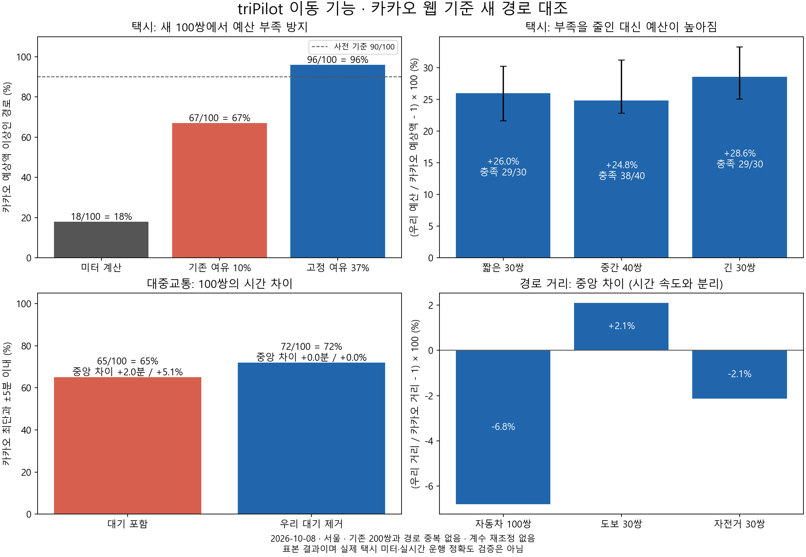
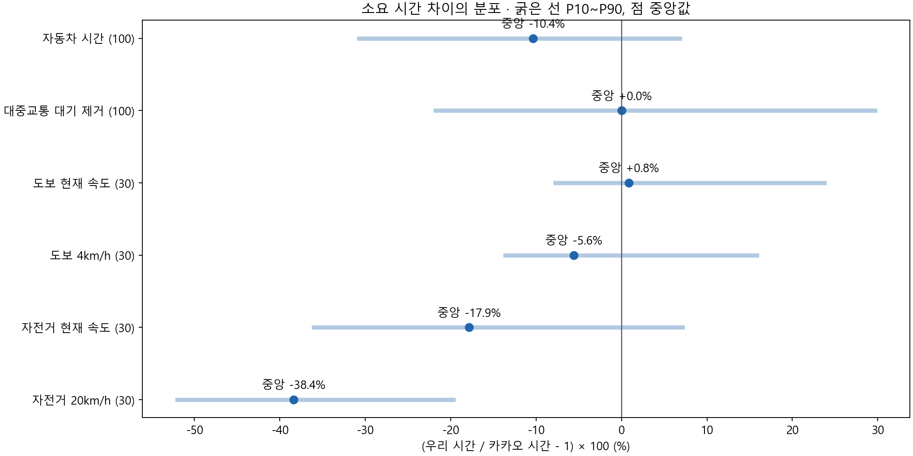
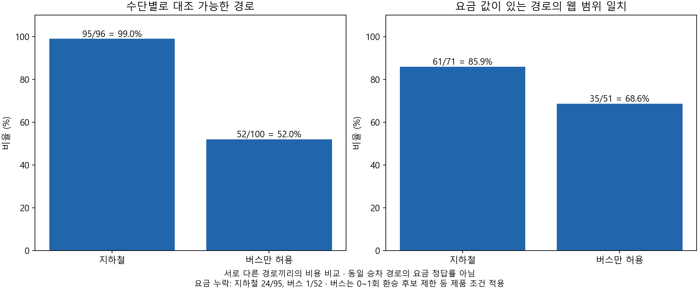

# 이동 기능의 새 100쌍 카카오 웹 대조

택시 예산 부족은 줄었지만, 경로 탐색과 시간 계산에 개선할 부분이 남았습니다. 37% 여유율을 고정한 새 표본에서 카카오 예상액을 덮은 경로는 96/100 = 96%였고, 예산은 중앙값으로 27.4% 높았습니다.

| 할 일 | 상태 | 진행 |
|---|---|---|
| 새 자동차·대중교통 경로 대조 | 완료 | 100/100 = 100% |
| 도보·자전거 추가 대조 | 완료 | 60/60 = 100% |
| 첫차·막차 탐색 확인 | 완료 | 1/1 경로 = 100% |
| 그림·집계·보고서 | 완료 | 4/4 = 100% |

대중교통은 우리 대기를 빼면 중앙 차이가 0분이지만, 개별 경로의 평균 절대 차이는 4.48분입니다. 버스만 허용하면 52/100 = 52%에서 경로를 냈고, 자전거 시간은 중앙값으로 17.9% 짧았습니다. 다음 개선은 버스 후보 탐색, 경로 거리, 자전거 지연 계산에 집중해야 합니다.

## 고정 보정값을 어떻게 검증했나

**37%는 기존 자료로 산정해 설정에 넣은 고정 보정값입니다.** 기존 200쌍 중 시각 조건이 맞는 자료를 나눠 학습용 153쌍에서 산정하고 별도 40쌍에서 확인한 값입니다. 개별 장소나 경로마다 카카오 정답을 반환하도록 만든 예외표는 이번 택시 계산 경로에 넣지 않았습니다. 산정 과정은 [앞 보정 보고서](2026-10-08_0343_택시_예산여유_보정과_시각일치_검증.md)에 있습니다.

이 보정은 부족할 가능성을 줄이는 **여행 예산 여유**입니다. 실제 미터 요금의 정확도를 높인 것과 구분해야 합니다. 미터 계산에는 서울시 공표 요율을 적용하고, 그 계산액에 여유율 37%를 적용해 최소 1,000원, 100원 단위 올림으로 별도 여유를 더합니다. 통행료에는 여유율을 곱하지 않습니다. [서울시 택시 요율](https://sftc.seoul.go.kr/seoul/mulga/main/contents.do?menuNo=200023)은 법정 요율의 근거이며, 37%의 근거는 우리 대조 자료입니다.

이번에는 기존 200쌍과 출발·도착 좌표가 겹치지 않는 새 100쌍을 먼저 정하고, 여유율과 규칙 파일의 해시를 고정했습니다. 새 웹 값을 본 뒤 요금 계수나 제품 계산 코드를 다시 맞추지 않았습니다. 기존 40쌍도 교체하지 않았습니다.



## 택시는 부족 방지와 요금 정확도를 함께 본다

아래 세 계산은 **동일한 새 100쌍, 동일한 미터 계산 결과**에 적용했습니다. 여유율을 제외한 조건은 같습니다. 이전 200쌍의 조회 시각 혼합 결과와 직접 비교하지 않습니다.

| 계산 | 카카오 예상액 이상인 경로 | 경로별 금액 차이 중앙값 | 경로별 비율 차이 중앙값 |
|---|---|---|---|
| 미터 계산액과 통행료 | 18/100 = 18% | −900원 | −7.2% |
| 기존 여유 10% | 67/100 = 67% | +400원 | +3.0% |
| 고정 여유 37% | 96/100 = 96% | +2,700원 | +27.4% |

여유율 37%를 적용해도 4/100 = 4%는 카카오 예상액보다 100~600원 낮았습니다. 이 네 경로는 우리 도로 경로가 카카오보다 약 35~45% 짧았습니다. **원인 후보는 경로 차이**이며, 이 비교만으로 도로 연결·출입구·카카오 추천 정책 중 무엇이 원인인지 확정하지는 않습니다. 여유율을 계속 올리기보다 두 경로의 도로 구간을 비교해야 합니다.

거리대별 부족 방지 비율은 짧은 구간 29/30 = 96.7%, 중간 구간 38/40 = 95%, 긴 구간 29/30 = 96.7%였습니다. 사전에 둔 90% 표본 기준은 통과했지만, 실제 결제 상한이나 서울 전체의 96%를 보장하는 결과는 아닙니다.

## 시간은 대기 포함 전후를 나눠 본다

비율 차이는 각 경로에서 `(우리 값 / 카카오 값 − 1) × 100`을 계산한 뒤 중앙값을 냈습니다. 분모는 **그 경로의 카카오 표시값**입니다. 두 집단 중앙값을 나눈 비율과 다를 수 있습니다. 양수는 우리가 더 길게 계산했고, 음수는 더 짧게 계산했다는 뜻입니다.

| 시간 비교 | 표본 | 차이 중앙값 | 비율 차이 중앙값 | 평균 절대 차이 | ±5분 이내 |
|---|---|---|---|---|---|
| 자동차 시간 | 100쌍 | −1.70분 | −10.4% | 2.49분 | 88/100 = 88% |
| 대중교통 최단안, 우리 대기 포함 | 100쌍 | +2.00분 | +5.1% | 5.44분 | 65/100 = 65% |
| 대중교통 최단안, 우리 대기 제거 | 100쌍 | 0.00분 | 0.0% | 4.48분 | 72/100 = 72% |
| 대중교통 추천안, 우리 대기 포함 | 100쌍 | 0.00분 | 0.0% | 5.35분 | 66/100 = 66% |
| 대중교통 추천안, 우리 대기 제거 | 100쌍 | −1.50분 | −4.7% | 4.97분 | 68/100 = 68% |
| 도보, 현재 계산 | 30쌍 | +0.29분 | +0.8% | 7.04분 | 15/30 = 50% |
| 자전거, 현재 계산 | 30쌍 | −3.20분 | −17.9% | 4.67분 | 23/30 = 76.7% |

**중앙값 0은 개별 경로가 정확하다는 뜻이 아닙니다.** 대중교통의 대기 제거 후 비율 차이가 ±10%인 경로는 47/100 = 47%입니다. 짧게 계산한 오차와 길게 계산한 오차가 중앙에서 상쇄될 수 있습니다.



그림의 굵은 선은 표본의 P10~P90 구간입니다. 도보 4km/h와 자전거 20km/h는 **우리 거리만 속도로 나눈 참고 계산**입니다. 카카오의 신호·경사·경로 처리를 그대로 재현한 계산이 아닙니다. 자전거를 단순히 20km/h로 바꾸면 중앙 차이는 −38.4%로 더 커집니다. 속도 숫자만 바꿔 맞추는 방법으로 해결할 근거가 없습니다.

## 버스와 지하철은 경로 산출과 요금 누락을 분리한다

| 기능 | 결과 | 해석 |
|---|---|---|
| 지하철 경로 대조 가능 | 95/96 = 99.0% | 카카오에 지하철 안이 있는 96쌍 기준 |
| 버스만 허용한 경로 대조 가능 | 52/100 = 52% | 현재 후보·환승·도보 제한 적용 |
| 지하철 시간 ±5분, 우리 대기 제거 | 64/95 = 67.4% | 중앙 −2분, −5.9% |
| 버스 시간 ±5분, 우리 대기 제거 | 28/52 = 53.8% | 중앙 +4.5분, +12.3% |
| 지하철 요금 값 제공 | 71/95 = 74.7% | 24/95 = 25.3% 누락 |
| 버스 요금 값 제공 | 51/52 = 98.1% | 1/52 = 1.9% 누락 |
| 지하철 요금이 카카오 표시 범위에 듦 | 61/71 = 85.9% | 요금이 있는 경로만 분모 |
| 버스 요금이 카카오 표시 범위에 듦 | 35/51 = 68.6% | 요금이 있는 경로만 분모 |

요금 누락까지 실패로 포함하면 일치 비율은 지하철 61/95 = 64.2%, 버스 35/52 = 67.3%입니다. 위 요금 비교는 **서로 다른 경로의 비용 비교**이므로 동일 승차 경로의 요금 산식 정답률로 읽으면 안 됩니다.

버스 미산출 48쌍의 반환 이유는 고른 수단의 후보 없음 24/48 = 50%, 검토한 후보에서 성립안 없음 21/48 = 43.8%, 역 접근 상한 이유 3/48 = 6.3%였습니다. 이는 현재 계산기가 반환한 이유의 분류입니다. 서울 버스 노선 자료 전체에 경로가 없다는 결론은 아닙니다. 버스 직행 탐색은 장소 좌표를 사용하며, 실패 메시지의 지하철역 언급만으로 버스 탐색을 건너뛰었다고 단정할 수도 없습니다.

환승 횟수가 카카오 추천안과 같았던 경로는 전체 대중교통 66/100 = 66%, 수단별 최단안끼리는 지하철 77/95 = 81.1%, 버스 26/52 = 50%입니다. 대중교통 추천안의 도보 구간은 값이 있는 98쌍에서 중앙 −3.24분, −26.4%였고 평균 절대 차이는 5.26분입니다. 승하차 위치와 선택 경로가 달라 접근 도보 구간을 별도로 대조해야 합니다.



## 도보와 자전거의 거리 비교

| 수단 | 거리 차이 중앙값 | 비율 차이 중앙값 | 평균 절대 거리 차이 | ±10% 이내 |
|---|---|---|---|---|
| 자동차 100쌍 | −0.700km | −6.8% | 1.256km | 53/100 = 53% |
| 도보 30쌍 | +0.106km | +2.1% | 0.369km | 17/30 = 56.7% |
| 자전거 30쌍 | −0.089km | −2.1% | 0.383km | 16/30 = 53.3% |

도보·자전거는 카카오의 **최단거리 안**과 비교했습니다. 중앙 거리 차이가 작아도 개별 경로의 편차는 남습니다. 이번 자전거 대조는 도로 경로 계산이며, 따릉이 대여소까지 이동·대여·반납까지 포함한 전체 여행 시간은 아닙니다.

## 첫차 막차와 성립 판정의 추가 확인

카카오 지하철 웹 화면에서 5호선 한 경로를 별도로 조회했습니다. 평일 목표 도착 10:30에서 출발 09:48, 도착 10:27, 소요 39분은 우리 계산과 같았습니다. 첫차·막차 출발 시각 두 값은 2/2 = 100% 일치했고, 그 두 열차의 승차 시간은 우리 계산이 각각 1분 길었습니다.

첫차 직전·첫차·막차·막차 직후의 로컬 성립 판정은 4/4 = 100% 일치했습니다. **한 경로의 탐색 확인**이며 다른 노선, 분기, 주말, 환승 막차의 정확도를 입증하지 않습니다.

실시간 도착정보·혼잡·운휴·도로 사건·따릉이 잔여 자전거와 반납 가능 여부·일정 재배열·버스와 지하철을 섞는 경로 전체의 정확도는 이번 웹 대조의 측정 대상에 포함하지 않았습니다. 카카오 길찾기 카드만으로 이 기능들을 모두 검증한 것으로 기록하지 않습니다.

## 실험 조건과 재현 근거

- 표본: 서울의 공개 역·장소 좌표에서 고정 난수 seed 20261008로 선택한 새 100쌍. 직선거리 짧은 구간 30쌍, 중간 40쌍, 긴 구간 30쌍. 실제 범위는 각각 1.617~3.897km, 4.199~8.992km, 9.175~17.480km입니다. 출발·도착을 바꿔도 같은 쌍으로 세어 기존 200쌍과 중복 0/100 = 0%를 확인했습니다. 장소별 대표 표본이나 서울 전체의 무작위 이동 수요 표본은 아닙니다.
- 기준: [카카오맵 웹](https://map.kakao.com/)의 실제 화면에 표시된 자동차 100쌍, 대중교통 100쌍의 후보 카드 1,449개, 도보·자전거 각 30쌍을 읽었습니다. 조회 시간은 2026-10-08 04:24:54~04:40:21 한국 시각입니다. 네 묶음의 전사 결과를 각각 대조한 뒤 합쳤습니다. 경로별 원값은 git에서 제외되는 로컬 데이터 폴더에 보관하며 공개 자료에는 집계만 싣습니다.
- 우리 계산: 제품과 같은 이동 엔진을 로컬에서 직접 실행했습니다. 택시는 각 웹 조회 시각에 맞췄고, 대중교통은 평일 2026-10-08 10:30 도착 조건입니다. 카카오 일반 대중교통 카드에는 같은 도착 시각을 지정하지 않았으므로 **엄밀한 동일 시각 대중교통 비교는 아닙니다**. 우리 승차·환승 대기만 제거한 보조 비교를 함께 냈습니다. 자동차도 역사적 속도 자료와 웹 현재 추정의 비교이며 실제 운행 측정이 아닙니다.
- 통계: 각 경로의 차이를 먼저 계산했습니다. 집계에는 중앙값, 평균 절대 차이, 허용 범위 비율과 P10~P90를 사용했습니다. JSON의 중앙값 재표집 구간은 고정 표본 내 2,000회 재표집 결과이며, 층별 이동 수요를 반영한 서울 전체 보장 구간이 아닙니다. 새 표본으로 계수를 다시 학습하지 않았습니다.

재현용 자료는 [집계 JSON](assets/2026-10-08_mobility_fresh_100/summary.json), [입력 해시와 조건 기록](assets/2026-10-08_mobility_fresh_100/evidence.json), [재계산 도구](../../../scripts/mobility/run_fresh_web_experiment.py), [집계·그림 도구](../../../scripts/mobility/summarise_fresh_web_experiment.py)에 있습니다. 규칙 고정과 입력 ID는 로컬 자료에 기록되어 있습니다.

저장소 폴더에서 다음 명령을 쓰면 **보관된 입력으로 집계와 그림**을 새 출력 폴더에 재생성합니다. 카카오 웹을 다시 조회하는 명령은 아닙니다. 기존 결과를 덮어쓰지 않으므로 매번 새 출력 폴더를 지정합니다.

```powershell
python -m scripts.mobility.summarise_fresh_web_experiment --out ..\.tmp\mobility-fresh-100-replay-new
```

로컬 단위 시험 8/8 = 100%, 로컬 자료를 사용하는 별도 보정 시험 1/1 = 100%, 새 도구 린트 2/2 = 100%를 통과했습니다. 보관된 입력을 다시 집계해 수치가 동일함을 확인했습니다. 최초 로딩 후 4개 작업을 병렬 실행한 경로 계산의 중앙 소요는 5.21초, P10~P90는 1.54~13.57초입니다. 도보·자전거가 포함된 경로와 아닌 경로를 섞은 엔진 실험 시간이며, 배포 API 응답 시간으로 해석하지 않습니다.

mock 서버 시험: 이번 범위 실행 안 함 — 화면 변경 없음.

실서버 확인(서버 응답): 안 했음 — 배포된 cs 프로젝트 서버 요청과 실제 운행은 측정하지 않았습니다. 로컬 이동 엔진 결과와 카카오 웹 표시를 대조했습니다.

## 개선 우선순위와 공유 자료

1. **버스 후보 탐색과 요금 제공**: 카카오가 경로를 낸 48개 미산출 사례를 버스 직행·환승·접근 도보 단계별로 추적합니다. 지하철 요금 누락 24개도 원인별로 확인합니다. 제한을 무조건 풀거나 정답 경로를 예외표로 넣지 않습니다.
2. **택시 경로 거리**: 예산이 부족했던 네 사례의 도로 구간·출입구를 비교하고, 통계 속도와 현재 교통 차이는 출퇴근 시간·낮·심야의 별도 표본으로 나눠 확인합니다. 새 성능 조사 표본을 개선용 자료로 쓰면, 이후 최종 평가는 또 다른 미사용 표본으로 해야 합니다.
3. **자전거 시간과 접근 도보**: 신호·교차로·경사·승하차 위치의 기여를 따로 측정합니다. 속도나 여유율 하나를 바꿔 시간 전체를 맞춘 것으로 끝내지 않습니다.

[그림 세 장을 합친 벡터 PDF](assets/2026-10-08_mobility_fresh_100/mobility-fresh-100-charts.pdf)는 발표·공유용입니다. [그림 폴더](assets/2026-10-08_mobility_fresh_100/)에는 PNG, SVG, 개별 PDF도 있습니다.

수정 전 산출물은 [그림·집계 백업](assets/2026-10-08_mobility_fresh_100/_backup/2026-10-08_요금누락분리전/), 도구는 [집계 도구 백업](../../../scripts/mobility/_backup/2026-10-08_보고서재현성/)에 보존했습니다. 이번 추가 조사에서는 제품 계산 계수를 바꾸거나 배포·푸시하지 않았습니다.
