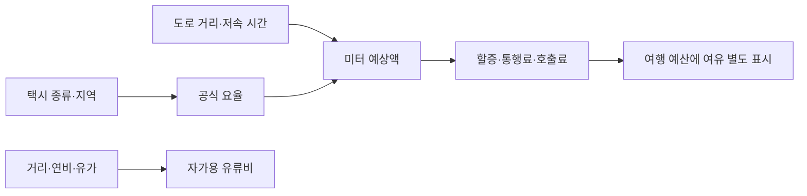

# 택시 공식 요율과 지도 웹 대조

택시 예상액은 공식 요율로 계산할 수 있습니다. 서울 일반 중형택시의 입력은 거리·저속 시간·할증이며, 소비한 연료량은 승객 요금 입력이 아닙니다. 현재 계산의 개선 대상은 도로 경로와 저속 시간 추정입니다. 예산 여유 37%는 요율이 아니며 이번 세 구간으로 다시 맞추지 않았습니다.

| 할 일 | 상태 | 진행 |
|---|---|---|
| 공식 기준 조사 | 완료 | 1/1 = 100% |
| 네이버·카카오·구글 웹 조회 | 완료 | 3/3 = 100% |
| 현재 중형·대형 계산 재실행 | 완료 | 6/6 = 100% |

## 조사 범위와 근거

- 요청: 택시 요금에 거리·연료·차종이 영향을 주는지 공식 기준을 확인하고 네이버·구글 지도를 직접 조회한다. 여행 MVP 이동 판정 범위(v11 §5) 안의 조사이다.
- 조사일: 2026-10-08. 웹 관측 09:15~09:22 KST, 실제 지도 UI를 열어 표시값·스크린샷을 확인했다. API 호출·예약·결제는 하지 않았다.
- 서울 내 세 역 구간: 마포→강동, 천호→건대입구, 선릉→잠실새내. 새 100쌍 조사 중 설명용으로 고른 표본이며, 새 독립 평가 자료나 전체 정확도 표본이 아니다.
- 카카오는 기존 고정 좌표, 네이버는 역 검색 결과를 사용했다. 역 이름은 같지만 출입구·도로 진입점·경로·조회 시각이 완전히 일치하지 않는다. 따라서 서비스 간 요금 차이를 요율 정확도 차이라고 단정하지 않는다.
- 표시값은 지도 서비스의 **예상액**이다. 실제 탑승 미터 영수증을 수집한 실측 결제액은 아니다.
- 웹 원문·개별 예상액·좌표·스크린샷은 git 밖 `datasets/mobility/raw/kakao_golden/provider_check_2026-10-08/`에만 두었다. 이 문서는 공식 기준과 관측에서 얻은 차이만 남긴다.

## 공식 요금 기준

| 서울 택시 종류 | 주간 기본 | 거리 단위 | 시간 단위 | 시간·거리 관계 |
|---|---|---|---|---|
| 중형 | 1.6km까지 4,800원 | 131m당 100원 | 30초당 100원 | 15.72km/h 미만에서 거리와 시간 함께 |
| 대형승용·모범 | 3km까지 7,000원 | 151m당 200원 | 36초당 200원 | 15.10km/h 미만은 시간만, 이상은 거리만 |

중형 심야는 22~23시·02~04시 20%, 23~02시 40%이다. 대형승용·모범은 22~04시 20%이다. 시계외 할증·통행료·호출료는 적용 조건을 따로 확인해야 한다. 차량 모델이나 연료 종류 대신 **허가된 택시 서비스 종류**가 요율을 정한다. 대형승용·모범, 대형승합(카카오벤티 등), 고급(카카오블랙 등)은 다른 요금제이다. [서울시 공식 택시 요금표](https://sftc.seoul.go.kr/seoul/mulga/main/contents.do?menuNo=200023)

요율 단위 검산: 주간 중형 5km에 저속 시간이 0/5/10분이라고 가정하면 현재 단위 올림 산식은 7,400/8,400/9,400원이다. 이는 **조건을 고정한 계산 예시**이며 실제 미터기의 기본구간 소진·거리/시간 펄스·경계 반올림을 재현했다는 증거가 아니다. 같은 총 소요 시간이라도 정체·정차 시간의 비중에 따라 요금이 달라질 수 있다.

## 지도 서비스에서 확인한 것

**네이버**: 세 구간 모두 자동차 길찾기에서 예상 택시비와 연료비를 별도 표시했다. 공식 Directions 15 금융용 문서도 `taxiFare`와 `fuelPrice`를 구분한다. `cartype`은 톨게이트 요금 계산용이고, `fueltype`과 `mileage`는 유류비 계산용이다. 이 API 문서는 웹 화면 내부 산식과 완전히 같다는 증거는 아니다. 내부에서 평균 속도·신호 대기를 택시 요금으로 바꾸는 상세 산식은 이번에 확보하지 못했다. [네이버 공식 API 문서](https://api-fin.ncloud-docs.com/docs/ai-naver-mapsdirections15-driving)

**카카오와 네이버**: 추천 경로의 표시 거리가 세 구간 모두 달랐다(3/3 = 100%, 분모는 선택한 세 구간). 가장 큰 차이는 짧은 구간에서 1.7km였다. 카카오 추천 예상액은 네이버보다 1,700~2,600원 높았다. 마포→강동 네이버를 약 7분 뒤 재조회하니 거리는 같은 표시였지만 예상액이 200원 달라졌다. 웹 예상액을 고정 정답으로 둘 수 없다는 관측이다. 화면의 반올림된 거리만으로 요율 오차를 역산하지 않는다.

**구글**: 마포→강동을 좌표로 한 번, 역 이름으로 한 번 조회했다. 두 조회에서 자동차 경로 이용 불가와 검색 서비스 범위 밖 안내가 표시되어 택시 예상액을 얻지 못했다. 이는 이날 해당 PC 웹 구간의 관측이며, 구글 지도 모든 지역·모바일 앱에서 불가능하다는 뜻이 아니다. 공식 도움말의 차량 공유 예상액은 제공업체가 보내는 정보이며 지역·언어 제한이 있다. [구글 공식 도움말](https://support.google.com/maps/answer/7245278?hl=ko)

## 현재 계산 실행과 원인 분리

실행: 워크스페이스에서 `python .tmp/taxi_provider_check_20261008.py`. 각 구간을 카카오 관측 시각에 맞춰 중형·대형승용/모범으로 계산했다. 여섯 호출 모두 결과가 나왔다(6/6 = 100%). 중형 미터 예상액 대비 웹 예상액 차이는 카카오 -7.7%~-28.7%, 네이버 -6.9%~+1.6%였다. 경로가 다르므로 이 비율은 요율 오차율이 아니다. 37% 예산 여유를 더한 결과는 카카오 기준보다 세 구간 중 둘에서 높고 하나에서 낮았다(2/3 = 66.7%). 표본 세 개로 일반 보장률을 주장하지 않는다.

현재 [car.py:138](../../../app/domains/travel_ops/instances/mobility/engine/car.py#L138)은 각 도로 구간의 과거 시간대 평균 속도로 소요·저속 시간을 추정한다. 신호별 정지 시간이나 실시간 차량 속도 이력을 별도 입력받지 않는다. 평균 속도가 문턱보다 높으면 저속 시간이 0으로 나올 수 있지만, 이것만으로 실제 주행 중 정차가 없었다고 판단할 수 없다. 긴 구간과 짧은 구간에서 현재 계산의 저속 시간은 0초였다.

[car.py:270](../../../app/domains/travel_ops/instances/mobility/engine/car.py#L270)의 요율 계산과 [예산 여유 계산:285](../../../app/domains/travel_ops/instances/mobility/engine/car.py#L285)는 분리되어 있다. 중형은 전체 거리와 저속 시간을 합산하고, 대형승용·모범은 저속 거리를 뺀다. 시계외 여부는 서비스 호출에서 미판정이며, 할증은 출발 시각으로 하나를 고른다. 기본구간 내부의 시간 누적·주행 중 할증 경계 전환·미터기의 단위 경계 처리는 실제 미터와 별도 검증이 필요하다.

개선 순서:

1. 같은 도로 진입점과 같은 경로를 맞춰 **거리 차이**를 분리한다.
2. 신호 대기와 정체의 저속 시간 자료를 확보해 **시간 차이**를 분리한다. 총 이동 시간을 전부 저속 시간으로 넣으면 안 된다.
3. 미터기 계산 규칙을 검증한 뒤, 남는 불확실성만 독립 자료에서 **예산 여유**로 평가한다. 이번 세 구간을 근거로 37%를 재조정하지 않는다.

## 변경·검증·한계

- 제품 계산 코드와 요금 규칙은 변경하지 않았다. 해시 `3bd0059c04e2b5591a27a3f10ef233995301d0937ad3ea1feb5db1434d5f6443`가 실행 전후 같았다.
- JSON 원문·결과 건수와 금액 합산·해시를 확인했다. [검증 기록](../evidence/2026-10-08_0924_택시지도조사_검증.md).
- 새 산출물: 이 보고서, git 밖 원문 JSON·계산 JSON·개별 비교 문서·지도 스크린샷. 재실행 스크립트는 `.tmp/`에 두었다.
- 기존 wiki에는 이 결론과 링크 한 줄만 추가했다. 추가 직전 원본을 같은 폴더 `_backup/2026-10-08_0924_택시요율조사/`에 복사했다. 옛 조사 기록은 수정하지 않았다.
- mock 서버 시험: 안 했음(이번 요청은 지도 웹 조사와 로컬 계산).
- 실서버 확인(서버 응답): cs 프로젝트 서버는 안 했음. 네이버·카카오·구글 공개 웹 UI는 직접 확인했다.
- 실제 탑승 영수증·실시간 저속 궤적·네이버 API 응답은 미수집이다. 구글 모바일 앱은 확인하지 않았다. 배포·푸시는 하지 않았다.
