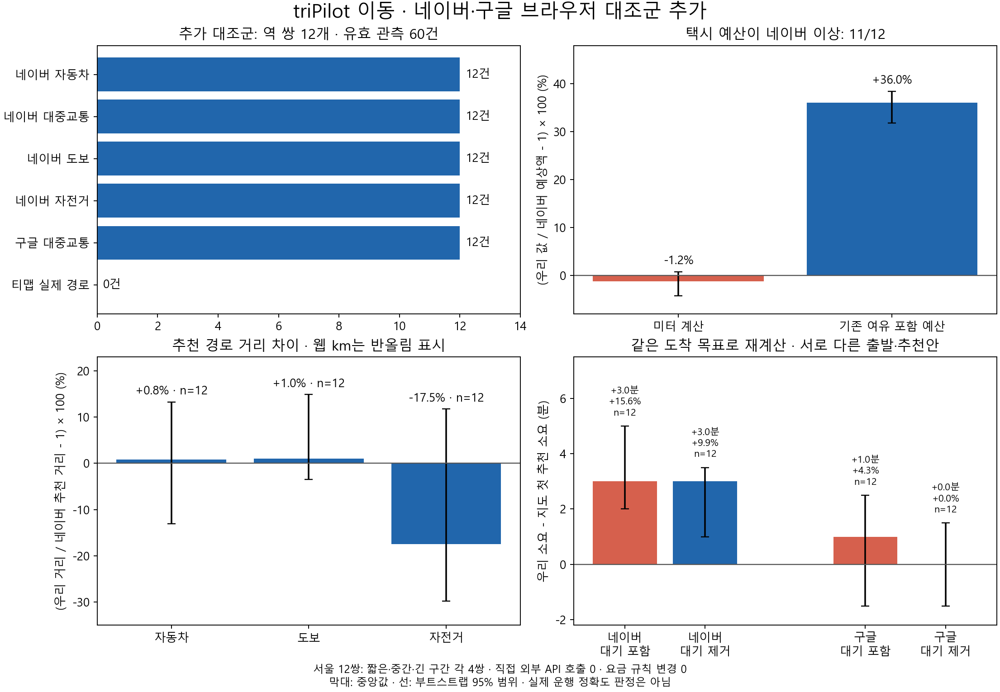

# 이동: 네이버·구글 웹 12쌍 대조군 추가

브라우저 검색으로 네이버 48건과 구글 12건을 추가 확보했다. 티맵은 조사한 공식 웹에서 실제 경로 입력을 확보하지 못했다. 개발자 지도 API 호출과 제품 요금 규칙 변경은 0건이다.

| 할 일 | 상태 | 진행 |
|---|---|---|
| 네이버 네 가지 이동수단 | 완료 | 48/48 = 100% |
| 구글 좌표 대중교통 | 완료 | 12/12 = 100% |
| 로컬 재계산·집계 | 완료 | 12/12 구간 = 100% |
| 티맵 실제 경로 | 미확보 | 0건 · 목표 분모 미정 |

택시 예산이 네이버 예상액 이상인 구간은 **11/12 = 91.7%**다. 대중교통에서 우리 승차·환승 대기를 제거한 중앙 차이는 네이버 **+3분 / +9.9%**, 구글 **0분 / 0.0%**다. 자전거 거리 중앙 차이는 **-17.5%**지만 편차가 크다. 이는 지도 예측과 우리 계산의 차이이며 실제 운행 정확도나 결제 상한 검증이 아니다.

## 자료와 비교 조건

- 기존 카카오 새 100쌍 중 짧은·중간·긴 구간 각 4쌍, 총 12쌍을 **조회 전에 고정**했다. 직전 수동 비교 3쌍은 제외했다. 새 출발·도착 쌍을 늘린 것이 아니라 같은 구간의 제공사 대조군을 늘린 것이다.
- 네이버는 자동차·대중교통·도보·자전거 각 12건. 구글은 대중교통 12건. 구글 이름 검색 12건을 보존한 뒤 전부 공통 역 좌표로 다시 조회했다. 총 관측 **72건**, 최종 집계 **60건**이며 중복 재조회는 유효 건수에 더하지 않았다.
- 이름 검색 중 두 구간에서 용산역이 용산구로, 한 구간에서 당산역이 당산동으로 표시됐다. 해당 이름 검색 결과를 최종 대조에 사용하지 않았다. 구글 최종 제목의 출발·도착 좌표 12/12와 네이버 URL의 역 이름·노선 48/48을 검증했다.
- 유효 웹 관측은 **2026-10-08 09:32:03~09:42:33 KST**. 네이버 대중교통 설정은 **09:27 출발**, 구글은 **지금 출발**이다. 카드별 출발·도착, 추천안·대안, 실제 선택 장소와 URL을 원문으로 보존했다. 네이버는 선택 노선의 역 POI, 구글·우리 계산·기존 카카오는 공통 역 좌표다. 출입구까지 같다고 주장하지 않는다.
- 자동차는 **네이버 읽기 시각**으로 우리 시각별 계산을 재실행했다. 대중교통은 각 제공사 **첫 추천 카드의 도착 시각**을 우리 도착 목표로 사용했다. 우리 계획에는 별도의 정책 여유가 있고 추천 노선·출발시각·실시간 교통 입력까지 같지는 않다. 웹 총 소요와 우리 대기 제거값은 완전히 같은 정의라고 단정할 수 없어 **대기 포함·제외를 모두 싣는다**.
- 비교 대상은 각 제공사 **첫 추천안**이다. 첫 추천이 가장 짧은 소요라는 뜻은 아니다. 표시 대안 중 최단 소요도 로컬 결과에 별도 보존했다. 도보·자전거는 네이버 추천 거리이며, 긴 거리의 정수 km 표시는 반올림된 값이다.

외부 지도 키·SDK·REST 호출을 사용하지 않았다. 로컬 계산은 `gh_url=""`, `seoul_key=""`, `local_router=True`로 실행하고 Python `urllib`·`requests` HTTP 호출을 차단했다. **HTTP 시도 0건**으로 완료했다. 브라우저 지도 페이지가 자체적으로 통신하는 것은 이 도구의 개발자 API 직접 호출과 구분한다.

## 우리 계산 대 네이버

차이는 **우리 - 네이버**, 비율은 **(우리 / 네이버 - 1) × 100**이다. 분모는 기능별 유효 12구간이다. 평균 절대 차이는 방향을 무시한 차이의 평균이며, P10~P90은 12구간 차이의 분포다.

| 항목 | 구간 수 | 중앙 차이 | 구간별 비율 차이의 중앙값 | 평균 절대 차이 | P10~P90 | 지정 범위 안 |
|---|---|---|---|---|---|---|
| 택시 미터 계산 + 통행료 | 12 | -100.00원 | -1.2% | 1116.67원 | -2660.00~+390.00원 | 9/12 = 75.0% (±1,000원) |
| 택시 기존 여유 포함 예산 | 12 | +3000.00원 | +36.0% | 4025.00원 | +2220.00~+7140.00원 | 1/12 = 8.3% (±1,000원) |
| 자동차 소요 | 12 | -3.08분 | -11.6% | 3.11분 | -5.74~-0.18분 | 9/12 = 75.0% (±5분) |
| 자동차 거리 | 12 | +0.07km | +0.8% | 1.70km | -2.71~+2.11km | 4/12 = 33.3% (±0.25km) |
| 도보 거리 | 12 | +0.07km | +1.0% | 0.68km | -0.68~+1.58km | 3/12 = 25.0% (±0.25km) |
| 도보 소요 | 12 | +0.33분 | +0.1% | 10.85분 | -8.83~+24.26분 | 4/12 = 33.3% (±5분) |
| 자전거 거리 | 12 | -1.07km | -17.5% | 3.00km | -7.67~+1.27km | 0/12 = 0.0% (±0.25km) |
| 자전거 소요 | 12 | -4.69분 | -20.4% | 12.73분 | -32.69~+3.70분 | 6/12 = 50.0% (±5분) |

택시 미터 계산의 비율 중앙 차이는 **-1.2%**이고, 기존 37% 여유를 포함한 예산은 **+36.0%**다. 예산이 지도 예상액 이상인 **11/12 = 91.7%**를 실제 결제 보장 비율로 읽지 않는다. 예산이 부족한 한 구간은 로컬 경로가 네이버 추천보다 짧았으며, 그 구간을 맞추기 위해 여유율이나 거리를 조정하지 않았다. 구간별 원값은 로컬 비교표에 있다.

도보는 거리 중앙 차이가 작아도 구간별 편차가 있다. 자전거는 네이버가 강변 자전거길을 선택하고 우리 계산이 더 짧은 도로를 고르는 사례가 있어, 거리·시간이 함께 짧아진다. 원문에서 확인한 경로 선택 차이의 사례이며 안전성·통행 가능성·편의 우열을 판정한 것은 아니다.

## 대중교통: 대기 전후를 둘 다 비교

| 참조·처리 | 구간 수 | 중앙 차이 | 구간별 비율 차이의 중앙값 | 평균 절대 차이 | P10~P90 | 지정 범위 안 |
|---|---|---|---|---|---|---|
| 네이버 · 대기 포함 | 12 | +3.00분 | +15.6% | 3.58분 | -0.70~+5.00분 | 11/12 = 91.7% (±5분) |
| 네이버 · 우리 대기 제외 | 12 | +3.00분 | +9.9% | 2.92분 | -1.70~+4.90분 | 12/12 = 100.0% (±5분) |
| 구글 · 대기 포함 | 12 | +1.00분 | +4.3% | 2.17분 | -2.00~+3.00분 | 12/12 = 100.0% (±5분) |
| 구글 · 우리 대기 제외 | 12 | +0.00분 | +0.0% | 1.83분 | -3.80~+2.90분 | 12/12 = 100.0% (±5분) |

네이버 첫 추천에 대한 ±5분 이내 구간은 대기 포함 **11/12 = 91.7%**, 대기 제외 **12/12 = 100%**다. 구글은 둘 다 **12/12 = 100%**다. **±5분은 이 표의 비교 범위이지 서비스 합격 기준을 새로 정한 것이 아니다.**

구글과 네이버의 첫 추천 소요 차이는 중앙 **+1.5분 / +4.9%**, ±5분 이내 **11/12 = 91.7%**다. 지하철·버스 추천 순서와 출입구가 다를 수 있으므로 소요가 비슷해도 같은 경로가 확인된 것은 아니다. 구글 카드에서 운전·도보·자전거는 이용 불가로 표시된 상태를 보존했다. 대중교통 내부 도보 구간은 별개다. [Google 지도 공식 안내](https://support.google.com/maps/answer/144339)는 이용 가능한 이동수단이 지역과 경로에 따라 달라질 수 있음을 설명한다.

## 기존 카카오 자료와 제공사 차이

카카오는 **같은 12구간의 04시대 관측**을 사용했다. 네이버·구글 오전 관측과 시각·교통·추천 경로가 같지 않다. 다음 표는 과거 자료와의 **관측 차이**이며 제공사 정확도 순위를 매기지 않는다.

| 비교 | 구간 수 | 중앙 차이 | 구간별 비율 차이의 중앙값 |
|---|---|---|---|
| 네이버 택시 예상액 / 카카오 | 12 | -600.00원 | -6.1% |
| 네이버 자동차 소요 / 카카오 | 12 | +8.00분 | +59.3% |
| 네이버 자동차 거리 / 카카오 | 12 | -1.25km | -21.9% |
| 네이버 대중교통 추천 / 카카오 추천 | 12 | -3.00분 | -12.1% |
| 구글 대중교통 추천 / 카카오 추천 | 12 | -0.50분 | -1.2% |

특히 자동차 시간이 중앙 +59.3% 달라졌는데 거리는 -21.9%다. 같은 장소라도 조회 시각과 추천 도로가 달라 거리·시간·요금이 함께 변한다는 증거다. [기존 새 100쌍 카카오 조사](2026-10-08_0503_이동_새100쌍_카카오웹_성능조사.md)와 이번 네이버 12쌍의 예산 충족률을 동일한 검증군처럼 합치지 않는다.

## 티맵 웹 조사 범위

[공식 내비게이션 소개](https://www.tmapmobility.com/service/drive/navigation), 공식 홈페이지, 옛 홈페이지 리디렉션, 공식 길안내 소개에서 [공식 데모](https://www.tmapmobility.com/support/data/path/demo)까지 브라우저로 확인했다. 데모는 **데모 이미지**와 개발자 API 가입·요금 링크를 제시했으며 출발·도착 검색 입력은 확보하지 못했다. 공식 도메인에 구간을 넣은 검색도 앱 기능 소개로 이어졌다. [공식 대중교통 소개](https://www.tmapmobility.com/service/public/public-transport)는 앱 안의 내비·대중교통·도보 비교를 안내한다.

따라서 티맵의 **실제 대조 경로는 0건**이다. 확인한 웹 범위를 넘어 ‘티맵 웹 경로는 불가능하다’고 결론내리지 않는다. **안 해본 것: 모바일 앱, 기존 사용자가 만든 공유 경로 웹 링크.** 개발자 API는 사용자 지시로 시험하지 않았다. 구글 지도 하단의 TMap Mobility 지도 데이터 표시는 구글 경로를 독립 티맵 경로로 세는 근거가 아니다.

## 반복·편차와 판정의 한계

경로·수단 조합별 원문은 1회 관측했다. 구글 이름 검색과 좌표 재검색은 입력이 다르므로 같은 조건의 반복 측정으로 세지 않는다. 목적 표본 12쌍이라 서울 전체로 일반화하지 않는다. 그림의 선은 **고정 시드로 2,000번 표본 재추출한 중앙값 95% 범위**다. 시간대별 반복 오차나 모집단 대표성을 보장하지 않는다. 자전거 거리 중앙 차이의 95% 범위는 **-29.8~+11.8%**로 0을 포함한다.

## 결과물·검증·보존

- [PNG 그림](assets/2026-10-08_mobility_multi_provider_12/multi-provider-overview.png) · [SVG](assets/2026-10-08_mobility_multi_provider_12/multi-provider-overview.svg) · [PDF](assets/2026-10-08_mobility_multi_provider_12/multi-provider-overview.pdf) · [집계 JSON](assets/2026-10-08_mobility_multi_provider_12/summary.json).
- [집계·로컬 재계산 도구](../../../scripts/mobility/summarise_multi_provider_web.py)와 [검증 기록](../evidence/2026-10-08_이동_네이버_구글_웹_12쌍_대조_검증.md). 기존 파일이 있으면 독점 생성 방식으로 중단해 덮어쓰기를 막는다.
- 원문·구간별 비교·스크린샷은 git 밖 `datasets/mobility/raw/kakao_golden/multi_provider_2026-10-08/`에 보관했다. 개별 지도 값은 공유 보고서에 복제하지 않았다.
- 원문 파싱 **60/60**, 최종 좌표·역 선택 확인 **60/60**, 시각·시간 경계 검산 **4/4**, 최종 파서와 저장 입력 일치 **60/60**, 린트 통과. 초회 집계에서 시간 뒤 노선 숫자를 읽는 오류가 발견돼 수정했고, 초회 2행 체크포인트를 남긴 채 새 파일로 전량 재계산했다.
- 제품 요금 규칙 해시 `3bd0059c04e2b5591a27a3f10ef233995301d0937ad3ea1feb5db1434d5f6443`는 전후 일치했다. 이번 원값에 맞춘 요금 계수 재조정은 없었다.
- mock 서버 시험: 이번 조사 대상 아님. 실서버 확인(서버 응답): **안 했음 — 배포된 cs 프로젝트 서버 응답은 조회하지 않았고, 로컬 이동 계산기를 실행했다.**
- [그림 이전 판 백업](assets/2026-10-08_mobility_multi_provider_12/_backup/2026-10-08_0951_그래프_글자정리/) · [생성 도구 백업](../../../scripts/mobility/_backup/2026-10-08_0946_다중지도집계/). [기존 wiki 백업](../../teams/_backup/2026-10-08_0953_다중지도대조/)도 인용 추가 직전에 만들었다. [로컬 비교표 백업](../../../../datasets/mobility/raw/kakao_golden/multi_provider_2026-10-08/_backup/2026-10-08_0954_비교표_줄간격/)은 줄 간격을 정리하기 전 판이다.
