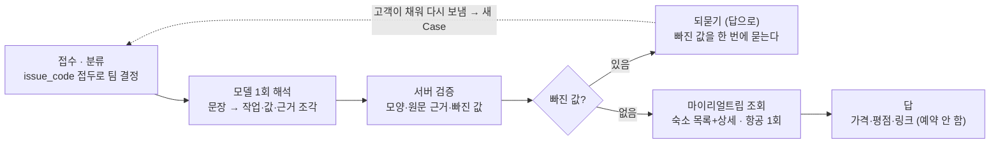

# 숙소·항공 에이전트 인계 (check-lodging)

2026-10-08 · 서유현 · 원본: Claude 문서 「숙소·항공 에이전트 인계 (check-lodging)」를 옮긴 것

## 요약

숙소 팀과 항공 팀이 Case 경로(`/v1/cases`)에서 실제로 돈다. 분류가 두 팀으로 보내고, 팀이 마이리얼트립에서 찾아 가격과 링크까지 답한다. 실제 모델(gpt-4o-mini)과 실제 마이리얼트립으로 확인했고, 숙소·국제선·국내선 링크가 모두 열린다.

- 브랜치: `check-lodging` (팀 저장소, 2026-10-08 push — 팀 커밋 `bf42b65` 위에 다섯 개)
- 예약·결제는 하지 않는다. 마이리얼트립 페이지 링크만 준다. 키도 필요 없다.
- 방식: 모델은 한 번만 불러 문장을 구조로 옮기고, 검증·조회·답은 서버가 한다.

**팀장이 정할 것 두 가지.** 둘 다 팀장 코드(코어·대화 부품)를 고쳐야 해서 손대지 않았다.

1. 웹 채팅(`/v1/web/trips/{id}/messages`)에서 숙소·항공 팀으로 가게 할지
2. 팀이 되물은 뒤 고객의 다음 메시지를 팀에 넘겨 대화로 이어 갈지

## 마이리얼트립으로 해 주는 것과 안 해 주는 것

찾아서 보여 주고 마이리얼트립 페이지로 보내는 데까지다. 예약·결제는 고객이 링크를 열어 마이리얼트립에서 직접 한다.

| 할 일 | 고객이 말하는 것 | 돌려주는 것 |
| --- | --- | --- |
| 숙소 찾기 | 지역 · 날짜 · 인원 (선택: 1박 상한, 최소 평점) | 상위 3곳. 곳마다 1박 가격 · 전체 가격(세금 포함) · 평점(5점 만점, 후기 수) · 주소 · 숙소 페이지 링크. 그 날짜에 객실 없는 곳은 건너뜀 |
| 내 숙소 찾기 | 예약한 숙소 이름 · 날짜 | 좌표 · 주소 · 숙소 페이지 링크. 이름이 여러 곳에 맞으면 후보를 보여 주고 되물음 |
| 항공 찾기 | 출발지 · 도착지(도시 이름도 됨) · 날짜(편도/왕복) · 인원 (선택: 좌석 등급, 직항만) | 최대 3편. 구간마다 출발·도착 시각 · 편명 · 소요 시간 · 총액. 국제선은 검색 결과 페이지 링크, 국내선은 노선 검색 링크 |
| 되묻기 | 조건이 빠진 문장 | 빠진 값(지역·날짜·인원 등)을 한 번에 묻는 답. 지어낸 날짜는 쓰지 않음 |
| 예약 상태 | 기존 예약 문의 | 잠긴 예약 조회(전의 「등록만」 팀과 같음) |

안 해 주는 것

- **예약·결제·취소**: 링크로 넘길 뿐이다. 우리 쪽에 예약 기록도 남지 않는다.
- **일정 저장**: 찾은 숙소·항공편을 일정에 넣지 않는다. 내 숙소의 좌표도 답으로만 준다.
- **객실 세부**: 객실 종류 고르기, 체크인 시각, 조식, 취소 규정은 안내하지 않는다.
- **순위 매기기**: 우리 기준(일정과의 거리 등)으로 다시 줄 세우지 않는다. 마이리얼트립이 준 순서 그대로다.
- **투어·액티비티**: 마이리얼트립 MCP에 도구는 있지만 쓰지 않는다.
- **대화로 이어 가기**: 되물은 뒤 고객 답을 이어 받지 못한다(아래 「팀장 코드 변경이 필요한 것」).

알고 쓸 것: 가격·잔여는 조회 시점 값이다. 호출 한도와 이용 조건은 공개된 것이 없다(429 거절 1회). 해외 숙소 검색과 외국어 사용자는 확인하지 않았다. 예약까지 서비스 안에서 하는 길(LiteAPI·Duffel 샌드박스)은 따로 검토 중이다.

## 넣은 것

팀 저장소 `check-lodging` 브랜치의 커밋 다섯 개다(위가 최신). 경로는 모두 `final_project_cs/` 아래다.

| 커밋 | 내용 |
| --- | --- |
| `0b7bf52` | 국내선 링크를 노선 검색 주소로 바꿈, 링크 확인 기록 |
| `db64e90` | Case 경로 확인 스크립트, 원문에 없는 날짜를 서버가 거름(프롬프트 v2) |
| `f69517b` | 항공 팀, 연도 없는 날짜 해석, 마이리얼트립 호출 상한 30초 |
| `0f87ac6` | 목록에 가격이 없는 숙소는 상세 조회를 건너뜀 |
| `f6dfc7a` | 마이리얼트립 검색 소스, 읽기 도구 3개, 숙소 팀 |

새 파일

| 파일 | 역할 |
| --- | --- |
| `app/domains/travel_ops/ports/data_sources/myrealtrip.py` | 마이리얼트립 MCP 어댑터(검색 전용, 키 없음) |
| `app/domains/travel_ops/instances/lodging/` (`team.py`, `interpret.py`) | 숙소 팀 |
| `app/domains/travel_ops/instances/flight/` (`team.py`, `interpret.py`) | 항공 팀 |
| `prompts/lodging/interpret.v2.md`, `prompts/flight/interpret.v2.md` | 해석 프롬프트 |
| `tests/unit/travel/test_myrealtrip_source.py`, `test_lodging_team.py`, `test_flight_team.py` | 가짜 모델·도구 시험 60개 |
| `scripts/try_lodging_team.py`, `try_flight_team.py`, `try_case.py`, `probe_myrealtrip_mcp.py` | 직접 돌려 보는 스크립트 |
| `wiki/records/reports/2026-10-07_1729_*`, `2026-10-07_1744_*`, `2026-10-08_1500_*`, `2026-10-08_1525_*` | 단계별 기록 |

기존 파일에서 바꾼 것

- `ports/data_sources/base.py`: `TravelSources.travel_search` 칸을 더했다. `build_travel_sources`가 항상 붙인다.
- `app/tools/read_tools.py`: 도구 `read.stay_search` · `read.stay_detail` · `read.flight_search`를 더했다. `ALLOWED_PROMPT_KEYS`에 `lodging.interpret` · `flight.interpret`를 더했다.
- `config/project.yaml`: `lodging` · `flight` 등록 경로를 새 폴더로 바꿨다. 옛 「등록만」 팀(`instances/locked/`)은 코드를 지우지 않고 등록에서만 뺐다.
- `app/domains/travel_ops/__init__.py`: 두 팀을 새 폴더에서 내보낸다.
- 분류 어휘(`core_hooks/feedback.py`)와 코어(`app/core`, `app/application`)는 고치지 않았다.

## 구조와 흐름

두 팀은 같은 모양이다. 모델은 한 번만 불러 문장을 고정된 구조로 옮기고(도시 이름 → 공항 코드도 모델이), 문장 규칙으로 뜻을 가르지 않는다. 서버는 그 구조를 검사하고, 도구를 부르고, 받은 값으로 답을 쓴다.

서버 검증은 세 가지다. 모양이 틀리면 고치지 않고 사람에게 넘긴다. 날짜는 모델이 인용한 근거 조각이 원문에 있을 때만 쓴다. 빠진 값은 서버가 다시 센다(지난 날짜·뒤집힌 날짜·같은 공항은 없는 값).

| 팀 | capability | 도구 | 호출 상한 |
| --- | --- | --- | --- |
| lodging | `lodging.assist`(기본) · `lodging.status` | `read.itinerary` · `read.stay_search` · `read.stay_detail` · `read.booking` | 7 |
| flight | `flight.assist`(기본) · `flight.status` | `read.itinerary` · `read.flight_search` · `read.booking` | 3 |

`*.status`는 전의 「등록만」 팀과 같이 잠긴 예약만 조회한다. 답의 근거(`evidence`)에는 모델 해석과 도구 결과가 남고, `decisions[0]`에 해석·빠진 값·걸러진 날짜(`ungrounded`)가 남는다.

## 실제로 돌려 본 결과

세 문장 모두 Case가 접수 → 분류 → 담당 팀 → 답으로 끝까지 돌아 resolved로 닫혔다. 기기는 노트북(playdata), DB는 `acop_check`, 모델은 gpt-4o-mini다. 2026-10-08 15:24 `scripts/try_case.py`로 쟀다.

| 문장 | 분류 | 담당 팀 | 전체 시간 | 답 |
| --- | --- | --- | --- | --- |
| 11월 6일부터 9일까지 성인 2명 용산 근처 호텔 찾아줘 | lodging_other | lodging | 22.9초 (첫 호출 준비 포함) | 숙소 3곳, 1박·전체 가격, 평점, 주소, 링크 |
| 서울에서 3박 할 숙소 추천해줘 | lodging_other | lodging | 4.6초 | 되물음(날짜·인원) |
| 김포에서 제주 11월 6일 갔다가 9일에 오는 비행기 성인 1명 | flight_other | flight | 3.4초 | 왕복 3편, 시각·편명·총액, 노선 검색 링크 |

링크는 브라우저로 직접 열어 봤다.

- **숙소**: 로그인하지 않아도 같은 상세 페이지가 열린다. 날짜·인원이 주소에 붙고, 화면 1박 가격도 답과 같다.
- **국제선**: 응답의 `searchUrl`(검색 결과 페이지)을 준다. `reservationUrl`은 열면 「가격 변동」 뒤 다시 검색으로 가서 쓰지 않는다.
- **국내선**: 응답에 `reservationUrl`만 있고, 열면 「가는편 여정이 마감되었습니다」 팝업이 뜬다. 고른 편 값(`flightinfo`)만 빼면 팝업 없이 같은 노선·날짜의 목록이 열려 그걸 준다.

돌리면서 찾아 고친 것

| 찾은 문제 | 고친 것 |
| --- | --- |
| 모델이 없는 날짜를 지어냄(「3박」만 있는데 체크인을 오늘로) | 날짜마다 근거 문장 조각을 같이 받고, 그 글자가 원문에 있는지 서버가 봄. 모델이 「빠졌다」고 적은 값은 쓰지 않음 |
| 연도 없는 「11월 6일」을 2023년으로 옮김 | 프롬프트에 연도 규칙을 적음. 서버가 걸러진 값은 되묻기에 그대로 보여 줌 |
| 모델이 빠진 값 넷 중 하나만 물음 | 모델이 센 것과 서버가 센 것이 같을 때만 모델 문장을 쓰고, 다르면 서버가 모두 나열 |
| 상위 숙소 상당수가 그 날짜에 객실 없음 | 목록에 가격이 없는 곳은 상세를 부르지 않고 건너뜀 |
| 마이리얼트립이 연달아 부르자 429 거절(`retryAfter` 60초) | 거절 뒤 그 시간 동안 부르지 않음. 상세 호출은 문장당 최대 4번 |
| 국내선 검색이 약 15초 걸려 호출 상한(20초)에 가까움 | 상한 30초(팀 전체 상한 90초보다 작음) |

## 확인 안 한 것

- **저장소 전체 시험**: 관련 시험 60개, 팀 배치·칸 규칙·분류 정렬은 통과했다. `tests/contract` · `tests/architecture` 묶음은 10/8 오전 DB가 꺼진 상태에서만 돌렸다. 당시 실패 12건은 DB 연결 11건과 `acop_composer` 미설치 1건이다. DB를 켜고 다시 돌리지는 않았다.
- **가격 기준**: 항공 총액이 승객 전체 합인지 1인 값인지 모른다. 성인 1명만 돌려 봤다.
- **평점 기준**: 숙소 화면은 4.8(후기 111), 우리 답은 4.7(후기 1,113)로 다르다. 두 값이 각각 무엇을 세는지 모른다.
- **항공사 이름**: 같은 TW727이 화면은 「트리니티항공」, 응답은 「티웨이항공」이다. 응답 값을 그대로 쓴다.
- **객실 세부**: 체크인 시각·조식은 응답에서 읽지 않는다(항목 뜻을 확인하지 못함).
- **이용 조건**: 마이리얼트립 MCP의 호출 한도와 이용 조건은 확인하지 않았다. 429를 한 번 받았다.
- **분류 안정성**: 「서울에서 3박 할 숙소 추천해줘」가 10/7에는 `other`, 10/8에는 숙소 팀으로 갔다. 한 번씩 본 것이다.
- **로컬 모델**: Ollama(Gemma)로는 돌려 보지 않았다. 이 PC 설정이 OpenAI다.

## 팀장 코드 변경이 필요한 것

둘 다 코드를 읽어서 확인한 것이고, 실행으로 확인하지는 않았다. 아래 바꿀 자리는 제안이다.

### 1. 웹 채팅에서 숙소·항공 팀으로 보내기

지금 웹 채팅(`POST /v1/web/trips/{id}/messages`)은 `components/conversation/trip_messages.py`의 `handle_trip_message`가 받아 결정 단위·TripDesk로 처리한다. 이 길은 팀(`Team.execute`)을 부르지 않는다. 그래서 채팅에서는 숙소·항공 팀에 닿지 않는다.

- 제안: 채팅이 숙소·항공 요청으로 본 문장을 Case 경로로 넘긴다. `open_case`(분류 포함) 다음 `Controller.run_case`를 부르고, 팀 답을 채팅 답으로 돌려준다. `scripts/try_case.py`가 같은 순서를 이미 돈다.
- 넘길 때 `subject_ref = {"kind": "trip", "id": <여행 id>}`를 실으면 두 팀이 `read.itinerary`로 일정(인원·첫날·마지막 날·장소)을 읽어 모델에 준다. 「이번 여행 숙소」처럼 날짜를 말하지 않아도 된다. 이 부분은 팀 쪽에 이미 들어 있고 가짜 도구 시험으로만 확인했다.
- 정할 것: 채팅 쪽에서 숙소·항공 요청을 무엇으로 가를지(결정 단위의 선택지에 더할지, 분류기를 쓸지).

### 2. 되물은 뒤 대화로 이어 가기

지금 두 팀은 되묻기를 대기(`waiting`)가 아니라 답(`completed`)으로 한다. 고객이 조건을 채워 다시 보내면 새 Case가 된다. 대기로 두면 같은 질문만 되풀이되기 때문이다.

- 원인: `presentation/api/cases.py`의 `POST /v1/cases/{id}/messages`는 `MessageRequest.message`를 받지만 `Controller.resume(tenant_id, case_id, token, actor_id, event_id)`에 넘기지 않는다. 다시 도는 팀은 `Controller._task`에서 `input_text=case["subject"]`, 즉 첫 문장만 받는다.
- 제안: `resume`이 고객 글을 받아 Case 상태에 남기고, `_task`가 첫 문장과 이어 보낸 글을 함께 팀에 넘긴다(예: `TEAM_STATE_KEYS`에 칸 하나를 더하거나 `input_text`를 이어 붙임).
- 그러면 두 팀은 되묻기를 `waiting`(`required_input_schema` = 빠진 값)으로 바꾸면 된다. 이 부분은 우리 쪽에서 할 수 있다.
- 정할 것: 고객 글을 어느 칸에, 어떤 모양으로 남길지. 다른 팀의 되묻기에도 같이 쓰이는 자리다.

## 돌려 보는 법

`final_project_cs`에서 실행한다. 시험은 네트워크·DB 없이 돈다. 나머지는 실제 모델(설정의 OpenAI 키)과 마이리얼트립을 부른다.

1. 시험: `python -m pytest tests/unit/travel/test_myrealtrip_source.py tests/unit/travel/test_lodging_team.py tests/unit/travel/test_flight_team.py -q`
2. DB 없이 팀만: `python -m scripts.try_lodging_team "11월 6일부터 3박 성인 2명 홍대 근처 숙소"` · `python -m scripts.try_flight_team "김포에서 제주 11월 6일 갔다가 9일에 오는 비행기 성인 1명"` — 모델 해석 원문까지 출력한다.
3. Case 경로(DB 필요): 먼저 `python -m scripts.register_prompts`(프롬프트 두 개를 DB에 올림, 「활성 프롬프트 4개 검증 완료」가 나와야 함), 그다음 `python -m scripts.try_case "문장"` — 전용 테넌트를 만들었다가 끝나면 지운다.
4. 마이리얼트립 원문 구조 보기: `python -m scripts.probe_myrealtrip_mcp --call searchStays --arg keyword=용산 --arg checkIn=2026-11-06 --arg checkOut=2026-11-09`

연달아 많이 돌리지 않는다. 마이리얼트립이 429로 거절한 적이 있다. 단계별 자세한 기록은 `wiki/records/reports/`의 위 네 보고서에 있다.
