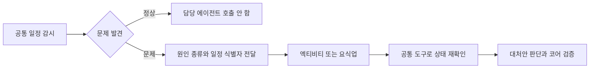

# 관리자 연결·감시 호출·요식업 동선 점검

관리자 화면을 실제 운영 기능에 연결하고, 요식업 추천의 앞뒤 이동 계산 누락을 보완했다.
운영자 계정이 없는 환경은 로그인을 허용하지 않는다. 배포와 계정 개통 상태는 별도 실행 기록으로 확인한다.

## 감시와 담당 에이전트

매분 도는 작업 일꾼에서 공통 일정 감시만 DB 주기 문으로 180초마다 실행한다.
문제가 없는 일정은 담당 에이전트를 부르지 않는다. 문제가 생긴 일정은 Case를 만들고,
`item_id`, `at`, `detected`, `categories`를 포함한 JSON trigger를 담당 에이전트에 전달한다.
여러 일정이 동시에 깨지면 항목 목록을 담은 사건으로 묶는다. 원자료 전체를 전달하는 계약은 아니다.
담당 엑티비티·요식업 에이전트는 공통 조회 도구로 현재 상태를 재확인하고 대처안을 결정한다.
공통 소스 캐시를 공유하므로 감시 평가 주기가 모든 외부 API의 재수집 주기를 뜻하지 않는다.

근거: `scripts/run_sweepers.py`, `components/watch/trip_watch_cases.py`,
`ports/data_sources/disruptions.py`, `instances/activity/team.py`, `instances/dining/team.py`
(도메인 경로는 `app/domains/travel_ops/` 아래다).

## 영업 확인 추천과 현재 상태

추천은 새벽 1회 + 식당으로 출발하기 전 1회 + 휴무 제보·일정 변경 같은 새 사건 발생 때 추가 확인이다.
방문 20분 전 고정보다 출발 전 확인이 이동 중 뒤늦은 변경을 줄인다. 두 번 확인으로 갑작스러운 휴무를 모두 잡는다고 보장하지 않는다.
현재 새벽 확인은 연결되어 있다. 60분/20분 전 확인 부품은 있지만 실제 작업 일꾼 호출과 조회 어댑터가 연결되지 않았다.
이번 작업에서 유료 조회를 더 자주 켜지 않았다. 고객에게 자원 여유에 따른 감시 품질 선택을 요구하지 않는다.

카카오 Local 장소 검색 응답에는 영업시간·임시휴무 필드가 없다. 반복 검색만으로 영업 여부를 확인할 수 없다.
구글 currentOpeningHours는 향후 7일의 특별 영업시간을 포함하지만 현장 상황의 즉시 갱신을 보장하는 근거는 확보하지 못했다.
Place Details Enterprise는 월 무료 1,000회 이후 첫 유료 구간에서 1,000회당 $20이다.
예시(실제 과금 아님): 식당 하나를 90분간 3분마다 조회하면 30회, 두 시점 조회는 2회다.
월 무료량을 이미 소진한 첫 유료 구간이라면 상세 조회만 각각 $0.60 / $0.04이며 검색·SNS·LLM 비용은 포함하지 않는다.

공식 문서 확인일: 2026-10-08.
- [카카오 Local 응답 항목](https://developers.kakao.com/docs/ko/local/dev-guide)
- [구글 상세 조회 요금 등급](https://developers.google.com/maps/documentation/places/web-service/place-details)
- [구글 공식 요금표](https://developers.google.com/maps/billing-and-pricing/pricing)
- [구글 장소·영업시간 필드](https://developers.google.com/maps/documentation/places/web-service/reference/rest/v1/places)

## 연결한 기능과 경계

운영 앱에만 관리자 JSON 경로를 등록하고 고객 API에는 등록하지 않는다.
서명된 운영자 쿠키, 요청 위조 방지 토큰, 기능별 권한, 로그인 실패 잠금을 사용한다.
고객 쿠키·사용자 키는 운영자 인증으로 인정하지 않는다. 별도 운영 프로세스와 로컬 접속 제한을 유지한다.
계측하지 않은 CPU·메모리·요청 지연은 미계측으로 표시한다. 연결 실패 때 데모 자료를 보여 주지 않는다.
관리자 기능 계약: [운영자 웹앱 연동](../../external/admin-screen-api.md).

사용자 차단·채팅 한도 예외·점검이 실제 고객 요청 관문에 적용된다.
외부 API 상한은 실제 호출 전 DB 예약에 적용되며 기존 제공처 상한을 조용히 높이지 않는다.
안전 감시 주기를 예산에 따라 느리게 바꾸는 편집은 비활성화했다.
문의·답변·공지·점검 배너를 고객 화면에 연결했고 본인 문의만 조회한다.
기존 설정·보관·접수·처리 근거 기능도 운영 앱 계약을 재사용한다.

요식업 동선 연결과 계산기 한계: [전용 보고서](2026-10-08_1450_요식업_앞뒤동선_배선.md).
다음 일정에 먼 후보는 기존 계산기의 상위 3개 재측정 범위를 유지하며 계산 불가 시 도보 어림을 사용한다.

## 검증 범위

- 요식업 관련 시험 43/43 통과.
- 관리자 보안·앱 분리·계층·소스 예산 시험 155/155 통과.
- 관리자 실제 DB 정책·자료 조회 시험 6/6 통과.
- 관리자 정책 및 기존 웹 제한 회귀 시험 34/34 통과.
- 고객 단위·렌더링 시험 6/6 통과, 타입·린트 통과.
- mock 서버 시험 3/3 (고객 문의·공지 화면 반응).
- 실서버 확인(서버 응답): 로컬 개발 DB 정책 확인 했음. x600 서버의 신규 코드 기능 확인은 배포 기록에서 별도 확인한다.

기존 웹 제한 통합 시험 최초 실패 2개는 기본 운영자 한도가 없는 호출에도 새 고객 외래키 행을 생성하던 문제였다.
별도 한도가 없으면 기존 웹 집계만 사용하도록 고쳤고, 한도를 뒤늦게 설정할 때는 기존 당일 사용량으로 초기화한다.
독립 외부 Codex 검토는 자동 승인 검토가 내부 설계·경로 전송 승인을 확인하지 못해 거절하여 실행하지 않았다.
로컬 독립 검토와 직접 시험을 그 외부 검토의 결과로 표시하지 않는다.
