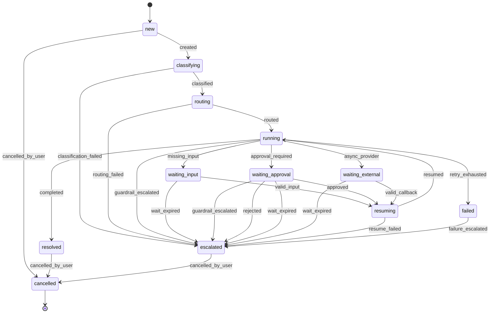

<!-- 이 파일은 `python -m scripts.make_state_diagram` 이 만든다. 손으로 고치지 않는다. -->
<!-- 출처: app/core/case_lifecycle/events.py:TRANSITIONS -->

# Case 상태 전이도 (자동 생성)

상태 12개 · 전이 25개. 이 표에 없는 전이는 `transition_case()` 가 거부한다.

## 전이표

| 상태 | 이벤트 | 다음 상태 |
|---|---|---|
| `new` | `cancelled_by_user` | `cancelled` |
|  | `created` | `classifying` |
| `classifying` | `classification_failed` | `escalated` |
|  | `classified` | `routing` |
| `routing` | `routed` | `running` |
|  | `routing_failed` | `escalated` |
| `running` | `approval_required` | `waiting_approval` |
|  | `async_provider` | `waiting_external` |
|  | `completed` | `resolved` |
|  | `guardrail_escalated` | `escalated` |
|  | `missing_input` | `waiting_input` |
|  | `retry_exhausted` | `failed` |
| `waiting_input` | `valid_input` | `resuming` |
|  | `wait_expired` | `escalated` |
| `waiting_approval` | `approved` | `resuming` |
|  | `guardrail_escalated` | `escalated` |
|  | `rejected` | `escalated` |
|  | `wait_expired` | `escalated` |
| `waiting_external` | `valid_callback` | `resuming` |
|  | `wait_expired` | `escalated` |
| `resuming` | `resume_failed` | `escalated` |
|  | `resumed` | `running` |
| `resolved` | `cancelled_by_user` | `cancelled` |
| `escalated` | `cancelled_by_user` | `cancelled` |
| `failed` | `failure_escalated` | `escalated` |
| `cancelled` | 없음 | 끝 |
