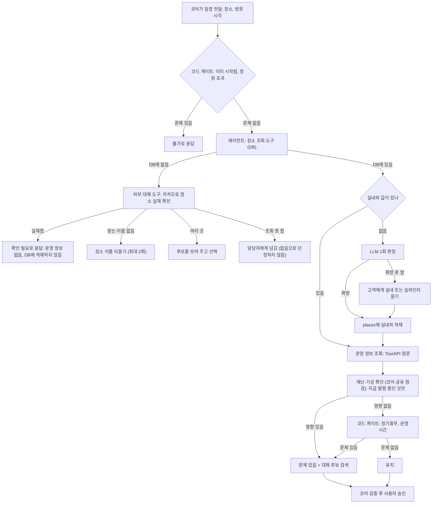
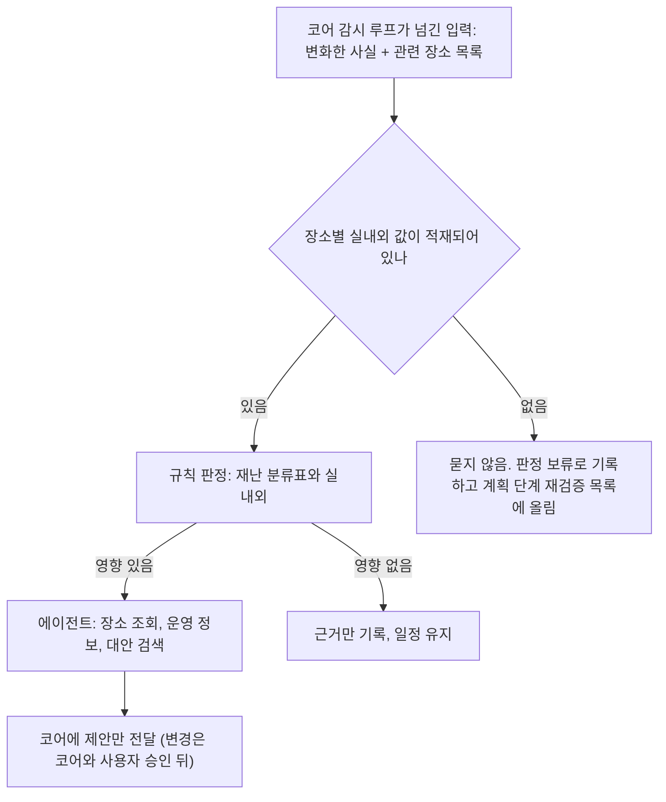
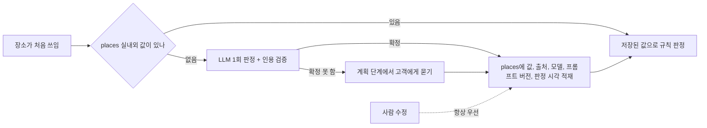
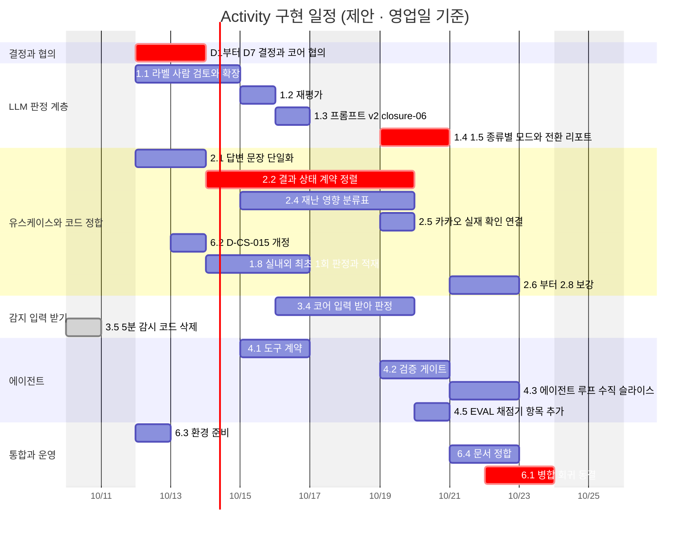

# Activity Team 구현 계획서

작성 2026-10-09 · 근거: 업로드된 4개 문서 (LLM 적용 테스트 실행 방법, 유스케이스 다이어그램 최종(10-04)·수정본(10-06), LLM 연동 계획서) + 팀 대화 기록

> **읽기 전에**
> - 처음에는 문서에 적힌 상태를 그대로 옮겼다. **2026-10-10에 §1.1 · §2.5-B · 부록 A를 코드(`activity/team.py`, `scripts/run_sweepers.py`)와 대조해 고쳤다.**
> - **범위는 Activity Team이 구현하는 것만이다** (2026-10-10 정리). 소스 수집 · 사실 테이블 · 알림 발송 · 코어 입력 경로는 코어 몫이라 뺐다(D-017). Activity는 코어가 넘기는 사실을 받아 판정하는 쪽을 맡는다.
> - 태그: `[완료]` 구현·측정됨 · `[제안]` 이 계획서의 제안 · `[결정 필요]` 사람이 정해야 함 · `[코어 협의]` 코어 담당과 합의 필요 · `[미확보]` 근거 문서 없음
> - 규모 S/M/L은 추정이다 (S ≤ 0.5일, M ≈ 1~2일, L ≈ 3일 이상).
> - 유스케이스 수정본(10-06)을 기준으로 삼고, 최종본(10-04)은 이전 버전으로 본다.
> - **개정 2026-10-09**: 멘토링 피드백(10-08)을 반영했다. 해당 부분은 `[멘토]` 태그로 표시하고, 내용은 §2.5에 모았다. 멘토 피드백은 사용자가 전달한 메모 기준이며 원문 기록은 보지 못했다.

---

## 0. 한 페이지 요약

1. **현재 위치**: 규칙 판정은 구현됐고, LLM 판정 계층은 측정까지 끝났다(골든셋 정확도 0.987). D-CS-015로 develop 판 팀 코드(`team.py`)에 섀도로 붙였다 — 기본 모드는 `rule`이고 `.env`로 켠 환경만 `shadow`. `develop` 브랜치 병합은 아직이며, 고객 결과에는 쓰이지 않는다.
2. **가장 먼저 정할 것 두 가지**
   - **D1 에이전트 구조**: 지금의 판정 계층을 멘토 가이드의 "단일 에이전트 + 읽기 전용 도구"로 어떻게 잇는가 (권장: C안, 판정 계층을 끝낸 뒤 도구·검증기로 재사용).
   - **D2 재난 영향 기준 충돌**: 수정본 §8 분류표는 산사태를 "지역 위험형(구 전체 막음)"으로 두는데, 테스트 케이스 ④는 LLM이 `no_effect`를 내는 것을 기대한다. 채점 기준(EVAL-A4)도 분류표를 따르므로 LLM의 올바른 답이 오답 처리된다.
3. **멘토 피드백(10-08) 반영** `[멘토]`: ① 실내/실외는 처음 한 번만 LLM으로 판정해 장소에 적재하고 이후는 규칙으로 한다, ② 방문이 3시간 뒤라는 이유의 "재난 정보 미확인" 단서와 3시간 창을 없애고 재난은 실시간 확인만 한다, ③ 실내/실외를 모르면 계획 단계에서 고객에게 물어 확정하고 감시 루프에서는 묻지 않는다, ④ 다이어그램을 계획 검증과 감시 루프로 나눠 흐름이 보이게 다시 그렸다(§2.5).
4. **일정이 빠듯하다** (영업일 10일). 잘라낼 순서를 §4에 정해 두었다. Must는 자르지 않는다.
5. **라벨이 사람 검토를 거치지 않았다.** 골든셋 52건의 정답을 Claude가 붙였다. 규칙→LLM 전환 판단은 이 검토 뒤에 해야 한다.

---

## 1. 현재 위치

### 1.1 구현 상태

| 영역 | 상태 | 비고 |
|---|---|---|
| `check_feasible` 규칙 판정 | `[완료]` | 이미 시작됨 → 정원 → 재난·기상(코어 공유 점검 `read.disruptions`) → 정기휴무 → 운영시간 순 (`team.py:331`, `:441`) |
| 재난 막는 기준 | `[완료]` | 재난 정지(`planning/safety.classify`)와 같은 기준. 날씨형 위급재난은 막지 않음 (`[결정 2026-10-09 사용자]`, `team.py:418`) |
| `rank_alternatives` (haversine 거리) | `[완료]` | 반경 1→10km |
| 활동별 5분 재난 감시 | `[완료]` 삭제 (2026-10-10) | 연결된 적 없던 `activity/watch.py` · `watch_runner.py`와 시험 2개를 지웠다 (3.5). 재난문자 감시는 코어 3분 감시가 맡는다 |
| LLM 판정 계층 (5종) | `[완료]` 섀도 | develop 판 `team.py`에 연결(D-CS-015). 모드 `rule/shadow/llm`, 기본 `rule` |
| 감지 → 판정 호출(4a1) | 미구현 | 코어가 넘기는 사실 변화를 받아 판정 (3.4) |
| 에이전트 루프 (멘토 가이드) | 미착수 | |

### 1.2 측정값 (LLM 연동 계획서 기준)

| 지표 | 값 |
|---|---|
| LLM 골든셋 정확도 | 0.987 (154/156), 신뢰구간 [0.962, 1.000] |
| 규칙 정확도 (develop 판, 재측정) | **26/52** — 휴무 16/16 · 운영시간 3/14 · 실내외 1/10 · 재난 6/12 (LLM 연동 계획서 재측정) |
| 규칙 정확도 (옛 role-activity 판, 참고) | 24/52 → 수정 후 33/52 — 휴무 16/16 · 운영시간 3/14 · 실내외 6/10 · 재난 8/12 (위험한 오류 4건) |
| LLM이 틀린 2건 | 모두 closure-06 |
| 휴무 판정만 보면 | LLM 0.958 < 규칙 1.000 → 휴무는 규칙 유지가 맞다 |
| live_status | 16/24 성공 (8건 429), 일관성 3/8, p50 15.7초, p95 40.7초 |
| 원문 해석 판정 (웹 없음) | 호출당 ≈ $0.0003, p50 1.7초 · p95 3.1초 |
| live_status 호출당 비용·토큰 (웹 검색) | ≈ $0.032 · 17k~30k 토큰 |
| 동시성 6 | 24/24 실패 → 동시 호출 제한 필요 |
| 테스트 | 2247 passed |

> 골든셋 60건 중 52건에 라벨이 있고, 라벨은 Claude가 붙였으며 사람 검토 전이다. 위 정확도는 "Claude 라벨 대비"로 읽어야 한다.

---

## 2. 결정이 필요한 일곱 가지

### D1. 에이전트 구조 `[결정 필요]` `[코어 협의]`

| 안 | 내용 | 장점 | 단점 |
|---|---|---|---|
| A | 판정 계층 그대로 유지 | 추가 작업 없음 | 멘토 가이드(에이전트 + 도구 + 게이트)와 멀어짐 |
| B | 에이전트로 전면 교체 | 가이드와 일치 | 측정된 검증기를 버림, 일정 위험 큼 |
| **C (권장)** | 판정 계층을 끝낸 뒤, 그 부분(인용 검증·출처 검증·종류별 판정)을 도구와 검증 게이트로 재사용 | 측정 자산 재사용, 단계적 | 두 구조가 한동안 공존 |

멘토 확인이 필요하다. P0는 "단일 에이전트 + 읽기 전용 MCP 도구 5개(장소 조회, 운영 정보, 장소 실재, 재난 사실, 대안 검색) + 코드 게이트 + HITL"이다.

### D2. 재난 영향 기준 충돌 `[결정 필요]` — 가장 중요

- 수정본 §8: 산사태 = **지역 위험형** → 해당 구 전체(실내 포함)를 막는다.
- 테스트 ④(종로구 인왕산 등산로 산사태 vs 경복궁): 기대는 LLM `no_effect`.
- EVAL-A4는 "분류별로 채점"이라서 분류표대로 `blocks`가 정답이 되고, 올바른 LLM 답이 오답으로 채점된다.

| 안 | 내용 |
|---|---|
| a | 분류표를 따른다 (LLM 관련성 판단을 끈다) |
| b | LLM 관련성 판단을 따른다 (분류표는 힌트로만) |
| **c (권장 구현)** | 둘 다 기록한다 (분류표 결과 + LLM 결과), 고객 결과는 보수적인 쪽 |

결정은 b 방향을 권한다. 안전 비대칭을 둔다: LLM이 "막지 않음"으로 완화하려면 **인용이 반드시 있어야** 하고, 확신이 낮으면 막는다.

### D3. 정원 초과 `[결정 필요]`
유스케이스는 "판정 항목이 아님"으로, 코드·LLM 계획서는 `problem`으로 본다. 한쪽으로 정리한다. 정원 데이터(capacity)는 TourAPI 추가 컬럼이라 비어 있는 경우가 많다.

### D4. 결과 상태를 계약에 맞추기 `[코어 협의]`
`insufficient_info`는 계약 밖 값이다. 계약 04 §5는 정보 부족 → `waiting` + `wait_for_input` + `wait_reason='customer_input'`, 근거 없음 → `escalated` + `failure_code`. 계약 01/04 §5의 원문을 먼저 확인한 뒤 매핑표를 만든다. 계약 개정이 필요하면 계약 01부터 고친다.

### D5. 종류별 LLM 전환 `[결정 필요]`
- 후보: 운영시간(규칙 3/14), 재난 관련성. **실내외는 `[멘토]` 따라 "요청마다 판정"이 아니라 "최초 1회 적재"로 바뀌었다** (§2.5-A). 단 D-CS-015는 「실내외 LLM 판정은 비교용으로만 돌리고 저장하지 않는다」이므로, 적재하려면 **D-CS-015 개정이 먼저다** (D7).
- 휴무는 규칙 유지. live_status는 제외(shadow만).
- **사람 라벨 검토 후에** 결정한다.
- 현재 모드는 전역 하나라 종류별 설정을 추가해야 한다.

### D6. live_status `[결정 필요]`
shadow로만 수집한다. 프롬프트 v2, 429 대응(재시도·동시성 1~2), `open_page` 과금 확인. 고객 결과에는 쓰지 않는다.

### D7. 운영 합의 `[코어 협의]`
D-CS-015(develop 판 섀도, draft) 개정 — 실내외 최초 1회 적재 허용(D5), 병합 순서, 그리고 `develop` 동결 (팀 공지: 개인 브랜치에서 작업).

---

## 2.5 멘토링 피드백 반영 (10-08) `[멘토]`

### 2.5-A 변경 요약

| # | 멘토 피드백 | 문서의 기존 내용 | 바뀌는 내용 | 영향 작업 |
|---|---|---|---|---|
| 1 | 실내/실외를 그때그때 판정하면 비효율. 지금은 고객 1건이지만 커지면 방대해진다 | LLM이 요청마다 실내외 판정 (조건: DB에 값 없음) | **처음 한 번만 LLM으로 판정해 장소(`places`)에 적재**, 이후는 저장된 값으로 규칙 판정 | 1.8, D5 |
| 2 | UC-A3 3a2 "방문이 3시간보다 뒤다: 재난 정보 미확인 단서를 붙인다"는 미확인 내용을 사용자에게 보여줄 필요 없음. 3시간도 필요 없고 실시간 확인만 | 방문이 3시간 뒤면 단서를 붙이고 4단계로 | **3a2 삭제.** 3시간 창과 "미확인" 단서를 없앤다. 재난은 그 시점의 사실(실시간)만 본다 | 2.7 폐기, 3.4 |
| 3 | 실내/야외를 모를 때 고객에게 묻는다 → 계획 단계에서 확정하고 실시간 검증에서는 뺀다 | 실내외 모름 → 확인 필요 | **계획 검증에서만** 모르면 고객에게 묻고 그 답을 적재. **감시 루프에서는 묻지 않는다** | 1.8, 3.4 |
| 4 | 계획 검증이냐 감시 루프냐에 따라 결과가 다르다. 케이스별로 나누고 세분화 | 다이어그램 하나 | 다이어그램을 둘로 나누고 케이스표를 만든다 (2.5-B, 2.5-C) | 6.4 |
| 5 | 흐름이 그림에 안 나타난다. 에이전트 → 장소 조회 → DB에 없으면 → 외부 대체 도구로 장소 실재 조회 | 도구 나열 중심 | 흐름도로 다시 설계 (2.5-B) | 2.5, 4.1 |
| 6 | 재난·운영 정보를 감시 루프에서 전달받을 때 관련 장소도 함께 입력 | 사실 테이블 변화 → 해당 활동 찾기(3.4)를 판정 쪽에서 | **감시 루프가 관련 장소를 찾아 입력에 함께 넣어 에이전트를 부른다.** 에이전트는 장소를 거꾸로 검색하지 않는다 | 3.4, 4.1 |

### 2.5-B 계획 검증 흐름 (UC-A3, 고객이 일정을 넣을 때)

에이전트가 도구를 부르는 순서가 그림의 가로 흐름이다. 장소 조회에서 DB에 없으면 외부 도구(카카오)로 실재만 확인한다 (응답 저장 금지). 판정 순서는 지금 코드(`team.py`)와 같다: 이미 시작됨 → 정원 → 재난·기상 → 정기휴무 → 운영시간.

### 2.5-C 감시 루프 흐름 (UC-B, 고객 요청 없이 주기적으로)

소스 수집 · 사실 테이블 · 변화 감지 · 관련 장소 찾기는 코어 감시 루프 몫이다(D-017). Activity는 코어가 넘긴 입력(변화한 사실 + 관련 장소)부터 맡는다. 이 흐름에는 고객에게 묻는 단계가 없다.

### 2.5-D 실내외 최초 1회 적재 흐름

### 2.5-E 케이스별 세분화

| 케이스 | 계획 검증 | 감시 루프 |
|---|---|---|
| DB에 있음, 실내외 있음 | 운영 정보 → 게이트 → 재난 확인 | 규칙 판정 (분류표 + 실내외) |
| DB에 있음, 실내외 없음 | LLM 1회 판정 → 적재. 확정 못 하면 **고객에게 묻고** 적재 | **묻지 않음**, 판정 보류 기록 `[결정 필요]` |
| DB에 없음, 카카오에 실재 | 확인 필요 (운영 정보 없음), 적재 안 함 | 해당 없음 (입력 장소는 감시 루프가 DB에서 찾아 줌) |
| DB에 없음, 카카오에 없음 | 이름 되묻기 (최대 2회) | 해당 없음 |
| 여러 곳을 가리킴 | 후보 제시 | 해당 없음 |
| 카카오 조회 실패 | 담당자에게 넘김 | 해당 없음 |
| 운영 원문이 비어 있음 | 휴무 판정 건너뜀. "확인 필요"로 올릴지 미정 | 해당 없음 (운영 정보 변화가 입력으로 오지 않음) |
| 방문이 한참 뒤 | 재난은 **지금 발령 중인 것만** 확인. "미확인" 단서 없음 | 사실 변화가 있을 때만 호출 |
| 지역 위험형 재난 | 구 전체(실내 포함) 영향 | 동일 |
| 야외 위험형 재난 | 실외 장소만 영향 | 동일. 실내외 값 없는 장소는 보류 |
| 재난 해제 | 해당 없음 | 해제가 입력으로 오면 재판정 |

> 감시 루프의 "판정 보류" 처리는 멘토 메모에 없는 부분이라 내가 채운 안이다. 값이 없는 장소를 영향 있음으로 볼지, 보류로 둘지는 안전 측면에서 정해야 한다.

### 2.5-F 남은 의문

1. 실내외를 일괄 적재(사전)할지, 처음 쓰일 때 적재(지연)할지: 지연 방식은 실제 쓰이는 장소만 비용이 든다. 시연 장소는 미리 데워 두는 것을 권한다.
2. 실내외 값 칸은 `places.weather_sensitive`(boolean, NULL = 모름)로 이미 있다. 없는 것은 **누가 · 언제 · 어떻게 정했는지**(출처 · 모델 · 프롬프트 버전 · 판정 시각)를 남길 칸이다. 데이터베이스 설계 문서의 변경이 필요하다. `[코어 협의]`
3. "3시간 창"이 없어지면서 활동별 5분 감시는 할 일이 없어졌다. 연결된 적도 없어(`run_sweepers.py`가 부르지 않음) 코드를 지웠다(3.5, 2026-10-10).

---

## 3. 작업 묶음

우선순위 (MoSCoW): **Must** WS-1.1~1.5, 2.1, 2.2, 2.4, 6.1 · **Should** 1.8, 2.5, 3.4, 4.1~4.3, 5.2 · **Could** 1.6, 2.6~2.8, 4.4~4.6 · **Won't (이번)** live_status 고객 반영·프롬프트 개선, 액-08.

> **`[2026-10-10 비효율 정리]`** ① 라벨 검토 전에 프롬프트를 고치면 Claude 라벨에 맞추는 일이 되어 다시 해야 한다 → 1.3은 1.1 뒤로. ② live_status는 고객에 안 쓰는데(D6) 프롬프트 · 429 대응에 힘을 쓰고 있었다 → 1.3에서 빼고 1.6은 Could. ③ 라벨 검토(1.1)와 골든셋 확장(5.1)을 따로 하면 같은 사람이 같은 자료를 두 번 본다 → 한 번에. ④ 실내외 적재가 1.8과 2.10에 겹쳐 있었다 → 1.8 하나로. ⑤ 이미 있는 것을 새로 만들게 돼 있던 항목(2.4 분류표, 2.5 카카오 실재 확인, 4.5 채점기)은 있는 것을 쓰도록 고쳤다.

### WS-1. LLM 판정 계층 마무리

| # | 작업 | 규모 | 비고 |
|---|---|---|---|
| 1.1 | 골든셋 라벨 사람 검토 **+ 확장(옛 5.1)** — 같은 검토 자리에서 새 사례도 라벨을 붙인다. 라벨은 규칙 · LLM 결과를 보기 전에 고정 | M | 라벨 확정 전까지 전환 결정 보류 |
| 1.2 | 재평가 | S | 확정 라벨로. `eval/activity_judge/run.py` 그대로 |
| 1.3 | 프롬프트 v2 — closure-06 오답만 (1.2 결과를 보고, 라벨이 틀린 것이었으면 하지 않는다) | S | **1.1 · 1.2 뒤**. live_status는 뺐다(D6) |
| 1.4 | 종류별 모드 설정 | M | 지금은 전역. 대상은 운영시간 · 재난 관련성 둘 (휴무는 규칙, 실내외는 1.8 적재, live_status는 섀도) |
| 1.5 | 6단계 전환 리포트 | S | 종류별 정확도·비용·지연 |
| 1.6 | 429·`open_page` 과금 (live_status 전용) | M | Could — 고객에 안 쓰는 판정이라 뒤로 |
| 1.7 | 실시간 shadow 수집 | M | 마이그레이션 031, `python -m scripts.register_prompts` |
| 1.8 | 실내외 최초 1회 판정 + 적재 **(옛 2.10 합침)**: 값이 없을 때 LLM 1회 → 확정이면 `places`에 적재(출처·모델·프롬프트 버전·판정 시각), 확정 못 하면 **계획 검증에서만** 고객에게 묻고 그 답을 적재. 감시 루프에서는 묻지 않음. 인용 검증 재사용 `[멘토]` `[코어 협의]` `places` 칸 · D-CS-015 개정 먼저 | M |

### WS-2. 유스케이스와 코드 정합

| # | 작업 | 규모 |
|---|---|---|
| 2.1 | 답변 문장 단일화 — 장소를 모를 때 "확인한 범위에서는 성립합니다 … 판정하지 않았습니다"로 답하던 자기모순은 고쳤다(`team.py:367`). 남은 것: 입력 "긴급재난"을 "위급재난"으로 출력하는지 develop 판에서 확인 | S |
| 2.2 | 결과 상태 계약 정렬 (D4) | M |
| 2.4 | §8 분류표 구현 + 실제 재해구분 값 매핑 — **새 표를 만들지 않고** 재난 정지가 쓰는 `config/guardrails.yaml`의 재난 분류(`day_kinds` · `trip_kinds`)에 「지역 위험형 / 야외 위험형」을 더한다. 표가 둘이면 재난 정지와 성립 판정이 또 어긋난다(10-09에 맞춘 기준) | M |
| 2.5 | 카카오 장소 실재 확인 흐름 — **도구는 이미 있다**: `read.place_lookup`(`activity/place_lookup.py`, `found`/`ambiguous`/`exists_unregistered`/`not_found`/`unknown`). 남은 것: 판정 흐름에 연결 + 이름 재질문 최대 2회 `[멘토]` | S |
| 2.6 | 방문 시각 경과 두 갈래 `[변경 제안]` | S |
| 2.7 | ~~재난 미확인 처리 (10분 / 3시간)~~ **폐기** `[멘토]`: 3a2 삭제, "미확인" 단서와 3시간 창을 없애고 재난은 실시간 확인만 | — |
| 2.8 | 대안 반경 1→10km, 정원 필터, 단서 문구 | M |
| 2.9 | 정원 초과 정리 (D3) | S |
| 2.10 | ~~실내외 확정 흐름~~ → **1.8로 합침** | — |

### WS-3. 감지 입력 받기

수집(재난문자 · TourAPI) · 사실 테이블 · 알림 발송은 코어 몫이다(D-017). 재난문자는 코어 감시가 3분 주기로 보고(`trip_safety`, `risk_report.py`), 관광공사 운영시간은 코어 새벽 읽기(`catalog_hours`, 03:00~08:00)가 맡는다.

| # | 작업 | 규모 |
|---|---|---|
| 3.4 | 코어 감시 루프가 넘기는 입력(변화한 사실 + 관련 장소)을 받아 판정 (에이전트는 장소를 거꾸로 찾지 않음) `[멘토]` `[코어 협의]` 입력 모양 | M |
| 3.5 | ~~활동별 5분 감시 코드 삭제~~ **`[완료]` 2026-10-10** — `activity/watch.py`(코어 `components/watch/watch.py`의 옛 사본 + 활동 감시) · `watch_runner.py` · 시험 2개 삭제 | S |

### WS-4. 에이전트 (D1 결정 후)

| # | 작업 | 규모 |
|---|---|---|
| 4.1 | 도구 계약 5개 (읽기 전용) | M |
| 4.2 | 검증 게이트 (인용·출처 검증기 재사용) | M |
| 4.3 | 에이전트 루프 수직 슬라이스. N=8, M=2는 근거 없는 시작값 | L |
| 4.4 | HITL 재개 | M |
| 4.5 | EVAL-A1~A8 채점기 (대부분 기계적 검사) — 새로 짜지 않고 `eval/activity_judge/`(`build.py` · `run.py` · `metrics.py`)에 항목을 더한다 | S |
| 4.6 | 관측성·예산 | S |

### WS-5. 평가

| # | 작업 |
|---|---|
| 5.1 | ~~골든셋 확장~~ → **1.1로 합침**. 실내외는 "최초 1회 판정" 정확도와 적재 후 규칙 일치를 따로 잰다(1.2에서) |
| 5.2 | 재난 4케이스 회귀 (①~④) |
| 5.3 | 3자 비교 (규칙 / LLM / 에이전트) |
| 5.4 | 장애 주입 (429, 타임아웃, 스키마 오류) |

### WS-6. 통합과 운영

| # | 작업 | 비고 |
|---|---|---|
| 6.1 | 브랜치 병합: `role-activity` · `role-activity-test` · `fix/activity-closure-rule` → `develop` | 팀 코드는 develop 판 `team.py`로 이미 합쳤다(옛 `team_a.py` · `feasibility.py`는 `legacy/`). 재난 점검도 `read.disruptions` 하나로 정리됨. 병합 전 충돌 지점은 다시 확인 |
| 6.2 | 결정 문서 (D-CS-015 개정 — 실내외 적재 허용, D7) | 1.8보다 먼저 |
| 6.3 | 환경 준비 | 특일 API 403 확인 포함 |
| 6.4 | 문서 정합 (부록 A) | |
| 6.5 | 공휴일 연동 | Could |

---

## 4. 일정 (제안 · 영업일 기준)

**자르는 순서**: Could 항목(1.6 포함) → 2.6~2.8, 3.4 → WS-4를 UC-A1 수직 슬라이스로 축소. **Must는 자르지 않는다.**

## 5. 마일스톤

| | 날짜 | 기준 |
|---|---|---|
| M1 | 10/14 | D1~D7 결정, 라벨 확정, 코어 협의 시작 |
| M2 | 10/16 | LLM 6단계 리포트, 종류별 모드 |
| M3 | 10/21 | 유스케이스 정합 테스트 통과 |
| M4 | 10/23 | `develop` 병합 — 전체 테스트 통과(2247에서 삭제한 5분 감시 시험 11건 제외), `ruff check .` 깨끗, 부록 A 불일치 0 |

## 6. 위험

| 위험 | 영향 | 대응 |
|---|---|---|
| 라벨이 Claude 작성 | 전환 판단이 틀림 | 1.1 사람 검토를 선행, 라벨 고정 후 재평가 |
| D2 미결정 | 채점·동작 불일치 | 안 c로 둘 다 기록하고 먼저 구현 |
| 코어 협의 지연 | 3.4(입력 모양), 1.8(`places` 칸) 막힘 | 코어 쪽 인터페이스를 스텁으로 먼저 |
| 병합 충돌 (`develop` 롤백 이력) | 판정 부분이 다시 덮임 | 6.1 전 동결, 충돌 지점 목록 사전 합의 |
| 비용·지연 — live_status(웹)만 ≈ $0.032, 10~40초. 원문 해석 판정은 ≈ $0.0003, 2~3초 | 웹 판정을 감지 루프에서 부르면 폭증 | live_status는 섀도 유지, 판정은 변화가 있을 때만 호출, 동시성 제한 |
| 429 | live_status 불안정 | 재시도·제한, 고객 반영 제외 |
| 일정 10일 | 미완 | §4 자르는 순서 |
| 위험한 오류(규칙 재난 4건) | 안전 | LLM 완화는 인용 필수, 낮은 확신은 막음 |

## 7. 시연 시나리오 연결

- **액-02 (미세먼지)**: 야외 위험형 분류 + 실내외 판단 + 실시간 재난 확인 → WS-2.4, 1.8, 3.4가 필요하다.
- **액-08**: 이번 범위 밖.

---

## 부록 A. 문서 간 불일치 (6.4에서 정리)

1. ~~재난 등급 기준~~ **정리됨** — 재난 정지와 같은 기준으로 막고 날씨형 위급재난은 막지 않는다(`[결정 2026-10-09 사용자]`, `team.py:418`). 유스케이스 · `activity.md`의 "위급재난만" 문구는 고쳐야 한다
2. 정원 초과의 취급 (D3)
3. 운영 정보가 비어 있을 때: "성립"으로 답함 vs "확인 필요" 미정
4. `insufficient_info` vs 계약 04 §5
5. 분류표 vs LLM 관련성 (D2)
6. 코드 주석 "LLM 미사용" vs D-CS-008 vs 에이전트 문서
7. 유스케이스 파일 두 개 (최종 / 수정본)
8. "자동 변경" 표현 vs D-020 (사용자가 고르는 설정)
9. `[멘토]` 유스케이스 수정본 §UC-A3 3a2("재난 정보 미확인" 단서)와 3시간 창, 실내외 "모를 때 확인 필요" 문구, 요청마다 LLM 실내외 판정은 멘토 피드백과 어긋난다. 유스케이스 문서와 `activity.md`는 팀 문서라 이 계획서에서 고치지 않았다

## 부록 B. 확인할 것

1. 계약 01·04 §5 원문
2. 최종 발표일 (v11 문서는 10/26이라 적혀 있으나 미확인)
3. 선호 정보 전달 경로 (코어 몫, `TEAM_STATE_KEYS`가 4개 키만 전달 — activity.md 10-01)
4. 카카오 키·상태
5. 특일 API 신청·403
6. 실시간 관측 100건 확보 가능성
7. 에이전트 모델·예산
8. 담당자 배정
