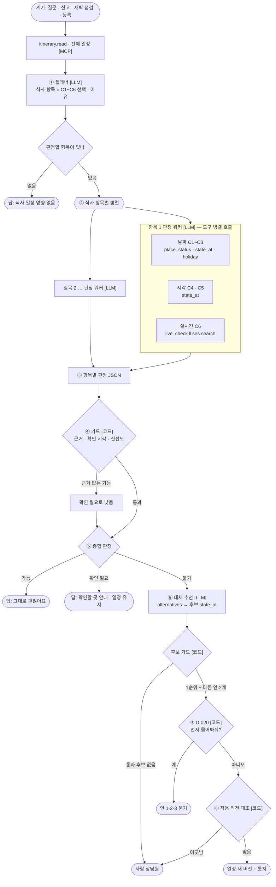

# Dining 에이전트 설계

`[2026-10-06]` 멘토 피드백을 Dining 팀 범위로 정리한 설계 문서다. 다른 팀(Activity · Mobility)은 다루지 않는다.

> ★`[2026-10-07]` **§2(MCP 도구) · §3(에이전트 설계)는 `dining-mcp-boundary.md` 로 대체됐다.** 다시 따져 보니 C1~C5 는 원장으로 코드가 판정하는 것이 맞고, LLM 에이전트는 코드 갈래에 맞지 않는 자유 질문에만 쓴다. SNS 검색(`sns.search`) · 실시간 구글 확인(`dining.live_check`) · 대체 후보 순서 제안은 뺐다. 아래 §2 · §3 은 처음 안의 기록으로 남긴다.

## 0. 왜 바꾸는가

멘토의 핵심 메시지:

> 룰베이스가 아니라, **LLM 이 MCP 도구를 쓰며 스스로 판정하는 에이전트**를 만들고, **체크리스트를 그 평가 기준**으로 삼아라.

`[실측 2026-10-06]` 지금 Dining 판정은 전부 코드가 정한 순서다(`app/modules/travel_ops/dining/team.py` `execute()`):

```
read.booking → read.place → read.dining_state → open_at_slot 이 True/False 인가
```

LLM 호출은 0회다. 무엇을 볼지, 어떤 순서로 볼지, 어떻게 결론 낼지를 코드가 다 정한다. 이러면 LLM 을 쓸 이유가 없다(멘토). API·DB 로 푸는 쪽이 싸더라도, **학습 목적상 기본 규칙 판정까지 LLM 이 잘하게 만드는 것**이 이번 목표다.

바꾸지 않는 것:

- **장소 검증 구조** — 「DB(원장)에 먼저 묻고, 없으면 지도 API 로 한 번 더」. 멘토가 방향이 좋다고 평가했다. 그대로 두고 **MCP 도구로 감싼다.**
- **안전 원칙** — 근거 없는 확답 금지, Team 의 직접 실행 금지, 승인 없는 side effect 금지. LLM 바깥의 가드로 남긴다(§3-5).
- **기존 룰베이스 경로** — 지우지 않는다. 비교 기준선(baseline)이자 기본 사례의 정답 생성기로 쓴다(§6).

---

## 1. 체크리스트 — LLM 평가지표

### 1-1. 정제 원칙

[식당_방문_체크리스트.md](../../../datasets/dining/식당_방문_체크리스트.md)(8개 절 · 약 55항목)는 「데이터에 있는가」 기준의 재고 조사였다. 멘토 피드백: **세분화는 좋지만 너무 많다. 사용자가 진짜 원하는 정보만, 큰 항목만.**

- 핵심 질문은 둘이다 — **「이 날짜에 갈 수 있는가」**, **「그 시간에 영업하는가」**
- 큰 항목만 노출한다 — 장기 휴무 · 공휴일 · 라스트오더 등
- 원장에 없고 실시간으로만 알 수 있는 정보는 **LLM 이 SNS 검색으로 채우는 항목**으로 넣는다
- 「주소/지도/핀/입구가 일정 설명과 맞는지」는 **뺀다** — 미세 좌표 오차 확인용이라 사용자에게 알릴 필요가 없다

### 1-2. 평가 항목 (6개)

| 핵심 질문 | ID | 큰 항목 | 정답 근거 (MCP 도구) | 판정값 |
|---|---|---|---|---|
| **이 날짜에 갈 수 있는가** | C1 | 폐업 · 이전 · 장기 휴업 | `dining.place_status` (원장 → 구글) | 가능 / 불가 / 확인 필요 |
| | C2 | 정기 휴무 (매주 · 매월 n째 주) | `dining.state_at` | 〃 |
| | C3 | 공휴일 · 명절 휴무 | `dining.state_at` + `calendar.holiday` | 〃 |
| **그 시간에 영업하는가** | C4 | 영업시간 · 브레이크 타임 | `dining.state_at` | 〃 |
| | C5 | 라스트오더 | `dining.state_at` | 〃 |
| **실시간** | C6 | 임시 휴무 · 재료 소진 · 대관 · 웨이팅 마감 | `dining.live_check` ‖ `sns.search` | 〃 + 출처 · 게시 시각 |

부록 (노출하지 않고 요청이 있을 때만 판정): 동행 · 식단 조건(아이 · 할랄 · 채식), 결제(카드). 지금의 `dining.check_conditions` 가 맡는다. `[제안]` — 핵심 질문 둘에 집중하려고 부록으로 뺐다. 팀 합의 필요.

예약 · 좌석 · 외국인 이용 등 나머지 세부 항목은 원장에 값이 있을 때 **참고로만** 답에 붙이고 채점하지 않는다.

### 1-3. 「가려던 구역이 닫혔나」 (미해결 질문)

멘토의 질문은 전시 · 체험 구역(Activity) 얘기다. 요식에서 같은 모양의 문제는 **「가려던 메뉴 · 코스 · 좌석이 그 시각에 나오는가」**(점심 특선 시간, 재료 소진, 루프탑 좌석 운영)다. 원장에는 없다(체크리스트 1절 「메뉴 제공 시간」은 조사 샘플 8곳 중 4건뿐). → **C6 실시간 항목으로 흡수**하고 SNS 검색 질의에 메뉴 이름을 넣는다. 못 찾으면 「확인 필요」 + 전화 번호 안내.

### 1-4. 채점 규칙

항목마다 LLM 의 출력을 정답과 비교한다. 감점이 큰 순서:

| 순위 | 오류 | 이유 |
|---|---|---|
| 1 | **과신** — 정답이 「확인 필요」·「불가」인데 「가능」이라 말함 | 사용자가 닫힌 식당에 간다. 핵심 원칙 위반 |
| 2 | **누락** — 판정해야 할 항목을 고르지 않음 | 예: 명절인데 C3 를 안 봄 |
| 3 | **근거 없음** — 판정에 출처 · 확인 시각이 없음 | 「확인 시각이 없으면 확인했다고 말하지 않는다」 |
| 4 | **과소** — 정답이 「가능」인데 「확인 필요」 | 불편하지만 안전 |
| 5 | **낭비** — 필요 없는 도구 호출 | 비용 · 지연 |

이 표가 모델 평가 보고서에서 **「어떤 기준으로 성능을 높였는지」의 근거**가 된다.

---

## 2. MCP 도구로 바꿔 LLM 손에 쥐여 준다

### 2-1. 지금은 어떻게 도는가

```
DiningTeam.execute()
  ├─ self._read("read.booking")      ← 코드가 부른다
  ├─ self._read("read.place")        ← 코드가 부른다
  ├─ self._read("read.dining_state") ← 코드가 부른다
  └─ if open_at_slot: "영업합니다" else: "영업하지 않습니다"   ← 코드가 결론 낸다
```

도구(`ReadToolbox`)는 이미 잘 만들어져 있다 — Team 별 허용 목록(`allowed_tools`), 호출 예산(`max_steps` → `ToolBudgetExceeded`), 같은 호출 반복 차단(`ToolLoopExceeded`), tenant 범위. 하지만 **부르는 쪽이 코드**다. 명절인데 공휴일 표를 볼지, 마감 직전이라 라스트오더를 볼지, 블로그에 임시 휴무 글이 있는지 찾아볼지 — 이런 판단을 코드가 `if` 로 미리 다 적어 둬야 한다. 적지 않은 경우는 영원히 안 본다.

### 2-2. MCP 란

MCP(Model Context Protocol)는 **LLM 이 외부 기능을 쓰는 표준 약속**이다. 구성은 셋이다.

| 구성 | 하는 일 | 우리 쪽에서 |
|---|---|---|
| **MCP 서버** | 도구 목록을 내놓는다. 도구마다 **이름 · 설명 · 입력 스키마(JSON Schema)** 를 선언하고, 호출이 오면 실행해서 결과를 돌려준다 | `dining` MCP 서버 — `ReadToolbox` 를 감싼다 |
| **MCP 클라이언트** | 서버에서 도구 목록을 받아 LLM 에게 보여 주고, LLM 이 요청한 호출을 서버에 전달한다 | Dining 에이전트 실행기 |
| **LLM** | 도구 설명을 읽고 **무엇을 부를지 스스로 고른다.** 결과를 보고 더 부를지, 결론 낼지 정한다 | OpenAI 모델(`app/infrastructure/llm/openai.py`) |

「손에 쥐여 준다」는 말은 이것이다 — **지금 코드가 순서대로 부르는 함수들을 「설명이 붙은 도구」로 바꿔 LLM 앞에 펼쳐 놓고, 어떤 도구를 언제 쓸지는 LLM 이 정하게 한다.**

그냥 함수 호출(function calling)과 무엇이 다른가: 함수 호출도 LLM 이 도구를 고르는 건 같다. MCP 는 그 도구 묶음을 **표준 서버로 분리**한다는 점이 다르다. 그래서

- 같은 도구를 우리 에이전트도, Claude Desktop 같은 외부 AI 도, 평가 하네스도 그대로 쓴다
- 도구 구현(DB · API)과 판단(LLM)이 깔끔하게 갈린다 — 도구는 「사실만 돌려준다」, 판정은 LLM
- 도구를 더하거나 바꿔도 에이전트 코드를 안 고친다. 서버의 목록만 바뀐다

### 2-3. 한 번의 판정이 어떻게 흐르는가 (예시)

여행자: 「추석 연휴 마지막 날 저녁 8시 반에 ○○식당 가는 거 괜찮아?」

```
LLM  : (도구 목록과 체크리스트를 읽고) 날짜가 추석이니 C3, 저녁 늦은 시각이니 C5 를 봐야겠다
LLM  → itinerary.read(trip_id)                      ← 일정에서 place_id, 방문 시각 확인
LLM  → dining.place_status(place_id)                ← C1: 원장 active, 확인 2026-09-20
LLM  → calendar.holiday(2026-09-26)                 ← C3: 추석 연휴
LLM  → dining.state_at(place_id, 2026-09-26T20:30)  ← C2·C4·C5: 원장은 영업, 라스트오더 20:30, 명절 규칙 없음 → needs_holiday_check
LLM  → sns.search("○○식당 추석 휴무", since=14일)    ← C6: 블로그 글 「추석 당일만 휴무」(09-18 게시)
LLM  : C3 = 확인 필요(연휴 마지막 날 영업은 SNS 로 추정), C5 = 불가에 가까움(20:30 이 라스트오더 시각) → 
       「8시 반은 라스트오더 시각이라 입장이 어렵습니다. 8시 전 도착을 권합니다. 연휴 영업은 전화 확인이 필요합니다」
가드 : 판정마다 출처·확인 시각이 붙었나 확인 → 통과
```

룰베이스였다면 `open_at_slot` 하나만 보고 「영업합니다」로 끝났을 사례다. 명절 · 라스트오더 · SNS 를 **필요할 때만 골라서** 본 것이 에이전트의 몫이다.

### 2-4. Dining MCP 도구 명세

도구 하나가 체크리스트의 한 질문에 답하도록 쪼갠다. 모든 도구의 결과에는 **`source`(어디서) · `confirmed_at`(언제 확인된 사실인가) · `status`(known / unknown)** 를 넣는다. 모르면 모른다고 돌려준다 — 빈 값을 「없음」으로 착각하게 하지 않는다.

| 도구 | 입력 | 하는 일 | 조회 순서 | 지금 코드 | 할 일 |
|---|---|---|---|---|---|
| `itinerary.read` | `trip_id` | 전체 일정 · 식사 항목 · 방문 시각 | DB | `ITINERARY_TOOLS` | 감싸기 |
| `dining.find_place` | `name`, `near?` | 이름으로 실존 확인, 지점이 여럿이면 후보 목록 | 원장 → 카카오 · 구글 | `dining/place_lookup.py`, `kakao_local.py` | 감싸기 |
| `dining.place_status` | `place_id` | 폐업 · 이전 · 장기 휴업 (C1) | 원장(일 배치 결과) → 구글 `businessStatus` | `google_places.verdict_from_details` 일부 | **새로** |
| `dining.state_at` | `place_id`, `at`, `until?` | 그 시각 영업 · 브레이크 · 라스트오더 · 정기 휴무 · 명절 규칙 (C2~C5) | 원장 | `read.dining_state(s)` | 감싸기 |
| `calendar.holiday` | `date` | 공휴일 · 명절 여부 | DB | `read.holiday` | 감싸기 |
| `dining.live_check` | `place_id`, `at` | 구글 실시간 영업 판정 (C6). ★약관상 원값은 저장하지 않고 판정만 남긴다 | 구글 | `google_places.open_verdict`, `dawn_check.py` | 감싸기 |
| `sns.search` | `query`, `since_days` | 임시 휴무 · 재료 소진 · 대관 등 최근 게시물 (C6). 게시 시각 · 링크 포함 | 네이버 검색(블로그 · 카페) | 네이버 검색 키 설정만 있음(`core/settings.py`) | **새로** |
| `dining.alternatives` | `near`, `at`, `conditions?` | 반경(700m) 안 대체 후보. 같은 가게 · 다음 일정과 겹침은 뺀다 | 원장 | `dining/nearby.py`, `itinerary_changes.py` | 감싸기 |
| `dining.place_price` | `place_ids` | 후보의 1인당 가격대 비교. ★약관상 저장하지 않는다 | 구글 | `read.place_price` | 감싸기 |
| `dining.conditions` | `place_id` | 동행 · 식단 · 결제 조건 (부록) | 원장 | `read.place` 의 dietary | 감싸기 |

도구 설명(description) 작성 규칙 — LLM 은 **설명만 보고** 고른다:

- 「언제 쓰는가」를 먼저 쓴다. 예: `dining.state_at` — 「특정 시각에 식당에 들어갈 수 있는지 볼 때. 브레이크 · 라스트오더 · 정기 휴무 · 명절 규칙을 함께 돌려준다」
- 「무엇을 모르는가」도 쓴다. 예: 「임시 휴무 · 재료 소진은 모른다 → `sns.search`」
- 이 설명도 프롬프트다. 평가 사이클(§6)에서 바꿔 가며 점수를 잰다

### 2-5. 구현 방식

```
app/modules/travel_ops/dining/mcp_server.py   (새로)
    FastMCP("dining")
    @tool dining.state_at(...)  →  ReadToolbox.call("read.dining_state", ...)
    ...
```

- 도구 실행은 **기존 `ReadToolbox.call` 을 그대로 통과**시킨다 → 허용 목록 · 호출 예산 · 반복 차단 · tenant 범위가 공짜로 따라온다
- `[실측 2026-10-06]` 지금 `app/presentation/api/mcp.py` 의 MCP 서버는 **고객용 도구 3개뿐이고, 앱에 mount 되어 있지도 않다**(`wiki/external/mcp-tools.md`). Dining 서버는 별도로 두고, 에이전트 실행기는 처음엔 **같은 프로세스 안에서** MCP 클라이언트로 붙는다(stdio / in-memory). 외부 노출은 나중 일이다
- 새 외부 호출(`place_status` 의 구글, `sns.search` 의 네이버)은 기존 `call_budget` · `ratelimit` · `cache` 를 쓴다

---

## 3. 에이전트 설계

### 3-1. 멀티에이전트 구성

| 에이전트 | 종류 | 하는 일 | 쓰는 MCP 도구 |
|---|---|---|---|
| 접수 분류 | LLM (기존) | 웹 채팅 · Case 문장에서 질문 · 신고 · 선택을 읽는다. 문장에 없는 값은 코드가 거른다 | — |
| **플래너** | LLM (새로) | 전체 일정과 계기를 보고 **판정할 식사 항목 × 체크리스트 항목(C1~C6)** 을 고르고 이유를 적는다 | `itinerary.read`, `dining.find_place` |
| **판정 워커** | LLM (새로) · 식사 항목마다 하나, 병렬 | 고른 C1~C5 를 도구로 확인하고 항목별 판정을 낸다 | `dining.place_status`, `dining.state_at`, `calendar.holiday`, `dining.conditions` |
| **실시간 조사 워커** | LLM (새로) | C6 — 구글 실시간과 SNS 를 함께 보고 휴무 신호를 찾는다 | `dining.live_check`, `sns.search` |
| **대체 추천** | LLM (새로) | 「불가」일 때 후보를 찾고 그 시각 영업을 다시 확인해 1순위 + 다른 안 2개를 고른다 | `dining.alternatives`, `dining.state_at`, `dining.place_price` |
| 가드 | 코드 | 근거 · 확인 시각 · 신선도 · 후보 재검증. LLM 판정을 낮출 수만 있고 올리지 않는다 | — |
| 적용 | 코드 (기존) | D-020 판정 문(`pending.apply_or_ask`) → 적용 직전 대조 → 일정 새 버전 · 통지 | — |
| 평가자 | LLM (오프라인) | 평가 때만. C6 처럼 정답이 글인 항목을 채점한다 | — |

### 3-2. 역할과 세부 작업 (프롬프트 골격)

멘토: 「LLM 에게 큰 역할과 세부 작업을 명확히 입력하라.」 플래너 기준:

```
[역할]  너는 여행 일정의 식사 항목이 실제로 성립하는지 판정하는 Dining 검증 에이전트다.
        추측으로 「가능」이라 말하지 않는다. 모르면 「확인 필요」다.
[입력]  전체 여행 일정, 계기(여행자 문장 · 신고 · 새벽 점검 · 등록), 지금 시각
[세부 작업]
  1. 일정에서 판정할 식사 항목을 고른다 (계기와 관련 있는 것만)
  2. 항목마다 체크리스트 C1~C6 중 판정할 것을 고르고, 고른 이유를 한 줄로 쓴다
  3. 도구로 근거를 모은다. 원장(DB)에 먼저 묻고, 모자랄 때만 지도 API · SNS 를 쓴다
  4. 항목별로 판정 · 근거 · 확인 시각을 낸다
  5. 「불가」가 있으면 대체 추천에 넘긴다 — 제안만 하고 직접 바꾸지 않는다
[출력]  아래 JSON
```

### 3-3. 출력 모양

```json
{
  "items": [
    {
      "item_id": "…",
      "place_id": "…",
      "checks": [
        {"id": "C3", "why_selected": "방문일이 추석 연휴", "verdict": "확인 필요",
         "evidence": [{"tool": "calendar.holiday", "source": "holiday_table", "confirmed_at": "…"},
                      {"tool": "sns.search", "source": "blog.naver.com/…", "posted_at": "2026-09-18"}]},
        {"id": "C5", "why_selected": "방문 시각이 마감 직전", "verdict": "불가",
         "evidence": [{"tool": "dining.state_at", "source": "dining_ledger", "confirmed_at": "…"}]}
      ],
      "overall": "불가",
      "message": "…",
      "alternatives": null
    }
  ]
}
```

이 모양이 곧 채점 단위다 — `checks[].id` 로 누락을, `verdict` 로 정확도 · 과신을, `evidence` 로 근거 부착을 잰다.

### 3-4. 분기와 병렬

- **병렬 ①** 식사 항목끼리 — 서로 독립이라 판정 워커를 항목마다 동시에 돌린다
- **병렬 ②** 한 워커 안의 도구 호출 — 날짜(C1~C3) · 시각(C4 · C5) · 실시간(C6) 은 서로 기다리지 않는다(parallel tool calls)
- **분기 ①** 플래너 — 판정할 항목이 없으면(식사와 무관) 바로 답
- **분기 ②** 종합 판정 — 가능 → 답 / 확인 필요 → 확인할 곳 안내 · 일정 유지 / 불가 → 대체 추천
- **분기 ③** 대체 후보 — 통과 후보 없음 → 사람 상담원 / 있음 → D-020
- **분기 ④** D-020 — 「먼저 물어봐줘」 · 「변경 안 할 일정」이면 안 1·2·3 을 보이며 묻고, 아니면 최고 안을 바로 적용
- **분기 ⑤** 적용 직전 대조 — 기준 버전 · 항목 · 장소가 어긋나면 폐기하고 사람에게

### 3-5. 가드 (LLM 바깥, 코드로)

| 가드 | 규칙 |
|---|---|
| 근거 가드 | `verdict = 가능` 인데 `evidence` 가 없거나 `confirmed_at` 이 없으면 → 「확인 필요」로 낮춘다 |
| 신선도 가드 | SNS 근거는 게시 시각이 방문일 기준 14일 이내이고 같은 지점일 때만 판정에 쓴다. 그 밖은 참고 |
| 후보 가드 | 대체 후보는 그 시각 원장 판정이 「가능」인 것만 남긴다(LLM 이 고른 후보도 다시 본다) |
| 실행 가드 | 일정은 에이전트가 쓰지 않는다. 기존 D-020 판정 문과 적용 직전 대조를 그대로 지난다 |
| 예산 가드 | 도구 호출은 `max_steps`(지금 12) 안에서. 넘으면 그때까지의 근거로 판정 + 「확인 필요」 |

가드가 고친 횟수 자체도 평가 지표다(§6-2) — 가드가 자주 고칠수록 프롬프트가 덜 됐다는 뜻이다.

---

## 4. 유스케이스

멘토의 정의: **특정 사용자가 특정 목표를 이루기 위해 시스템을 쓰는 모든 방법.** 목표 하나로 묶고, 개발하기 쉬운 단위로 나누고, 문제 상황도 단위에 넣는다. 넓게 먼저, 작게는 나중에. 문장은 「누가 무엇을 한다」.

멘토 지적: 예전의 「고객 요청 / 감시 이벤트」는 범위가 너무 컸다. 지금 코드의 실제 입구(웹 채팅 → `trip_messages` → 여행 창구 `TripDesk`, 신고 · 선택 버튼, 새벽 03:00 `dawn_check`, 일정 등록, Case 경로)에 맞춰 아래처럼 쪼갠다.

`[실측 2026-10-06]` 식당은 **새벽 3시에만** 확인한다(팀 결정 2026-09-24, `dawn_check.py`). 그 뒤 당일 문제는 고객 신고로 받는다. `dining/tick.py`(방문 60 · 20분 전 확인)는 코드만 있고 부르는 곳이 없다 — 이 설계도 그 결정을 따른다.

### 4-1. 넓게 — 목표별

| 목표 | 행위자 | 유스케이스 |
|---|---|---|
| G1 식당을 일정에 넣는다 | 여행자 | D1 |
| G2 그날 식사가 성립하는지 미리 안다 | 시스템 · 여행자 | D2, D3, D4 |
| G3 계획이 틀어졌을 때 대안을 받는다 | 여행자 | D5, D6 |
| G4 받은 대안을 고르거나 되돌린다 | 여행자 | D7, D8 |
| G5 조건 · 규정을 안다 | 여행자 | D9 |

### 4-2. 작게 — 유스케이스별

| ID | 누가 무엇을 한다 | 입구 | 판정 항목 | 분기 | 문제 상황 |
|---|---|---|---|---|---|
| D1 | 여행자가 일정에 식당을 등록한다 | 일정 접수 · 등록 판정 | 실존 + C1~C5 | 원장에 있음 / 없어서 API 로 찾음 / 둘 다 없음 | 지점이 여럿 · API 조회 실패(「없는 곳」이 아니라 「막힘」) |
| D2 | 시스템이 새벽 3시에 그날 식사 일정을 점검한다 | `dawn_check` 03:00~08:00 | C1(원장 → 구글) · C2~C5 · C6(SNS) | 가능 → 기록 / 확인 필요 → 아침 알림 / 불가 → 대체 → D-020 | 구글 호출 실패 → 기록 않고 창 안에서 다시 · 키 없음 → `disabled` |
| D3 | 여행자가 「그 시간에 영업해?」 「이 날 갈 수 있어?」라고 묻는다 | 웹 채팅 · Case 예약 문의 | C1~C5 중 플래너가 고름 | 대상이 일정에 없음 → 되묻기 / 가능 · 확인 필요 · 불가 | 브레이크 「모름」을 「없음」으로 보지 않는다 |
| D4 | 여행자가 출발 직전 「지금 가도 돼?」라고 묻는다 | 웹 채팅 | C6 (+ C4 · C5) | 휴무 신호 / 정상 신호 / 신호 없음 | 오래된 글 · 다른 지점 글 → 참고만 |
| D5 | 여행자가 늦는다고 알린다 | 웹 채팅 「30분 늦어요」 · 신고 버튼 | 늦은 시각으로 C4 · C5 | 가능 → 그대로 / 확인 필요 → 유지 / 불가 → 대체 | 늦는 시간을 모름 → 되묻기 · 문장에 없는 값 → 거부 |
| D6 | 여행자가 가 보니 문이 닫혔다고 알린다 | 웹 채팅 · 신고 버튼 | C1 · C6 (원인 기록) | 후보 있음 → D-020 / 없음 → 사람 | 고객 보고와 원장이 엇갈림 → 고객 보고를 근거로, 원장은 검토 필요 |
| D7 | 여행자가 다른 안으로 바꾸거나 되돌린다 | 다른 안 · 되돌리기 버튼 | 고른 안의 C4 · C5 | 가능 → 적용(D-020 안 지남) / 불가 → 경고 후 다시 묻기 | 지금 코드는 식당 다른 안을 다시 판정하지 않는다 → 이 설계에서 넣는다 |
| D8 | 여행자가 「먼저 물어봐줘」로 받은 안 중 하나를 고른다 | 안 고르기 버튼 | 고른 안의 C4 · C5 | 가능 → 적용 / 시간이 지나 기한 지남 → `expired` | 그사이 일정이 바뀜 → `stale`, 사람에게 |
| D9 | 여행자가 동행 · 식단 조건이나 취소 규정을 묻는다 | 웹 채팅 · Case | 부록 (조건 · 규정) | 알려짐 / 모름 | 조건 값이 모름 → 「모름」으로 답하고 확인처 안내 |

---

## 5. 멀티에이전트 다이어그램



읽는 법:

- **분기 조건**은 마름모 `{}` 와 화살표 이름이다 — 판정할 항목 유무, 가드 결과, 종합 판정, 후보 유무, D-020, 적용 직전 대조
- **병렬 구간**은 `{{}}` 와 워커 상자다 — 식사 항목끼리, 한 항목 안의 날짜 · 시각 · 실시간 도구 호출끼리 서로 기다리지 않는다
- 상자마다 **어떤 MCP 도구를 쓰는지** 적었다. 에이전트 ↔ 도구 ↔ 데이터 소스 전체 지도는 `dining-diagrams/1_Dining_에이전트_구조.html` 에 있다

---

## 6. 평가 사이클과 보고서

### 6-1. 사이클 (멘토)

1. **평가 기준을 직접 만든다** — §1 체크리스트 C1~C6 과 §1-4 채점 규칙
2. **테스트하며 결과 데이터를 쌓는다** — 실행마다 출력 JSON · 도구 호출 기록 · 점수를 남긴다
3. **실험 결과로 새 데이터셋을 추가한다** — 틀린 사례와 비슷한 사례를 더 만든다
4. **평가 방식 · 프롬프트를 바꿔 가며 점수를 높인다** — 역할 문장, 세부 작업, 도구 설명, 예시

### 6-2. 정답 세트와 지표

정답 세트(`eval/datasets/dining_agent/` 제안): 사례 하나 = 「여행 일정 + 지금 시각 + 계기 → 판정해야 할 C 항목들 + 항목별 기대 판정」.

| 묶음 | 정답 출처 | 예시 |
|---|---|---|
| 기본 | **룰베이스 경로**(원장 판정) | 평일 점심 정상 영업, 정기 휴무일 |
| 함정 | 사람이 만든다 | 명절 · 자정 넘김 · 브레이크 경계 · 라스트오더 직전 · 폐업 · 원장 「모름」 |
| 실시간 | SNS 응답을 고정한 재생본(`infrastructure/travel/replay.py` 방식) | 임시 휴무 글, 오래된 글, 다른 지점 글 |

| 지표 | 계산 |
|---|---|
| 항목 선택 재현율 | 골라야 할 C 항목 중 고른 비율 |
| 판정 정확도 | 고른 항목 중 판정이 맞은 비율 (항목별로도) |
| **과신율** | 「가능」이라 했는데 정답이 아닌 비율 — 가장 중요 |
| 근거 부착률 | 판정 중 출처 · 확인 시각이 붙은 비율 |
| 가드 개입률 | 가드가 판정을 고친 비율 |
| 도구 호출 수 · 비용 · 지연 | 사례당 평균 |

### 6-3. 보고서에 넣을 것

- 버전(프롬프트 · 도구 설명 · 모델)별 × C 항목별 점수표 — 「무엇을 바꿨더니 어느 항목이 올랐다」
- 룰베이스 기준선과의 비교 — 기본 묶음에서는 비슷하고, 함정 · 실시간 묶음에서 에이전트가 앞서야 한다
- 비용 비교 — 룰베이스가 싸다는 것을 숨기지 않고, 얻는 것(함정 · 실시간 대응)을 같이 보인다
- 기존 `eval/judge`, `eval/compare_baselines.py` 틀을 재사용한다

---

## 7. 멘토에게 할 질문

멘토가 ML 성능 테스트가 보고서 때문인지 물었고, 파인튜닝 질문도 해 달라고 했다.

1. ML 성능 테스트(분류 모델)는 보고서 산출물로 했다. 이번 에이전트 평가 보고서와 **하나로 묶는 게 나은가, 따로 두는 게 나은가?**
2. `[실측]` 예전 파인튜닝 모델은 golden · holdout 0% pass 로 채택하지 않았다(`wiki/decisions/D-CS-002`, 원인은 데이터 부족). 이번 평가 사이클로 쌓은 데이터로 **「C 항목 고르기」만 작은 모델로 파인튜닝**하는 것은 의미가 있나?
3. 프롬프트 개선과 파인튜닝의 차이를 의미 있게 비교하려면 **정답 세트가 몇 건쯤** 필요한가?
4. LLM 이 판정한 결과를 LLM 으로 채점(LLM-as-judge)할 때, 정답이 분명한 항목(C2~C5)은 규칙 채점으로 두고 **C6 만 LLM 채점**으로 하는 구성이 괜찮은가?

---

## 8. 결정이 필요한 것

| 항목 | 제안 | 상태 |
|---|---|---|
| 동행 · 식단 · 결제 조건 | 부록 (채점 밖) | 팀 합의 필요 |
| SNS 검색 출처 | 네이버 블로그 · 카페 검색 | 키 발급 상태 확인 필요 |
| SNS 근거 신선도 | 방문일 기준 14일 | 실험으로 조정 |
| 에이전트 모델 | 기존 OpenAI 경로 | 비용 상한 정하기 |
| 룰베이스 경로 | 기준선 · 정답 생성기로 유지 | — |

## 9. 작업 순서 (제안)

1. 정답 세트 기본 묶음 30건 + 룰베이스 기준선 점수
2. Dining MCP 서버 — 기존 도구 감싸기(`state_at` · `holiday` · `find_place` · `itinerary.read` · `alternatives`)
3. 에이전트 루프 + 출력 JSON + 가드 → 기본 묶음 점수
4. 새 도구 `place_status` · `sns.search` + 함정 · 실시간 묶음
5. 프롬프트 · 도구 설명 바꿔 가며 점수표 쌓기 → 보고서
